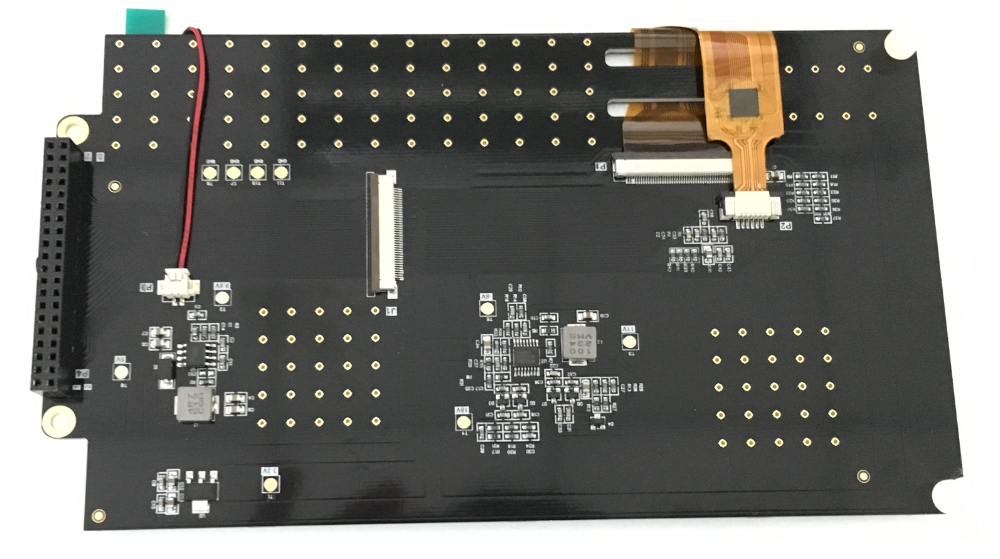
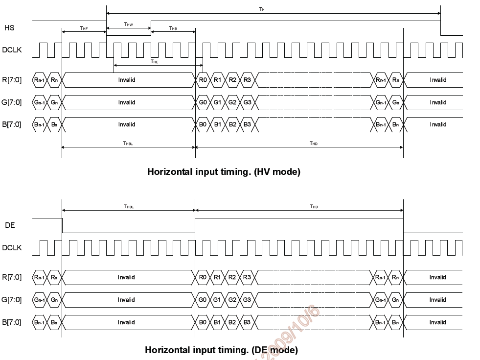
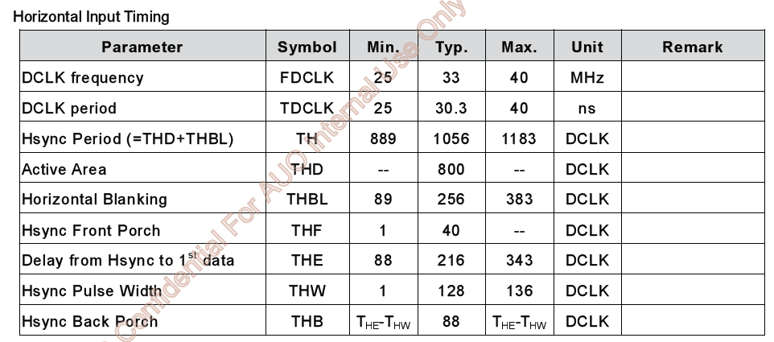
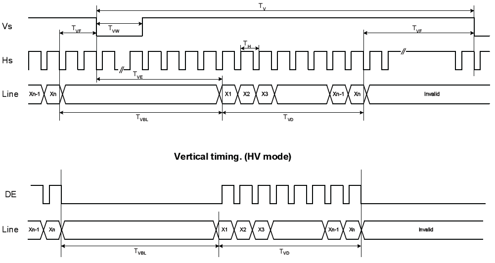
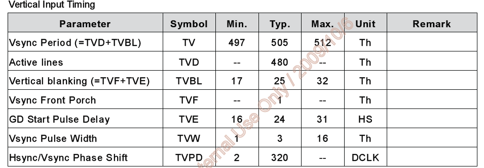
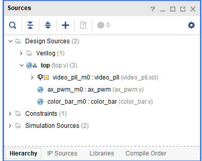
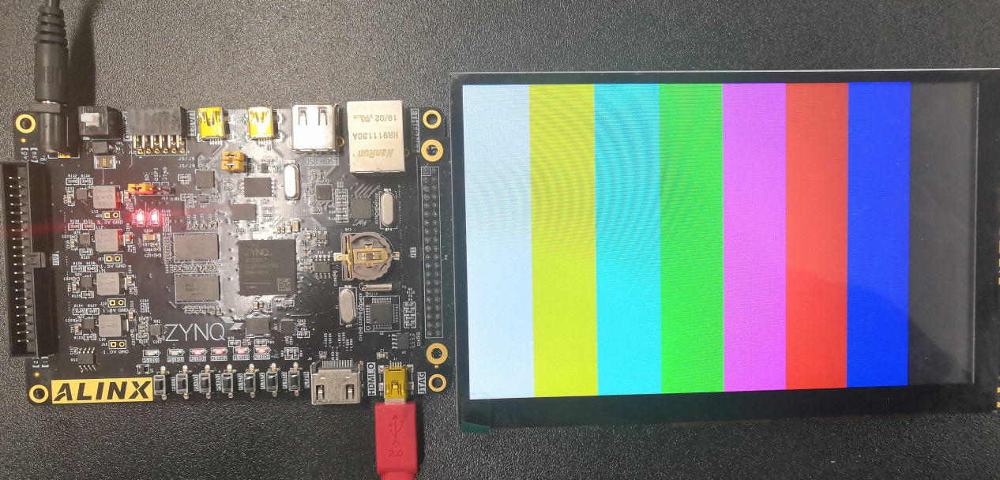
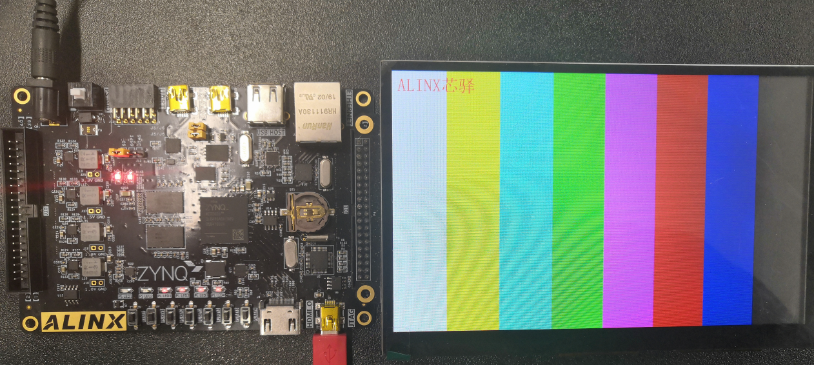
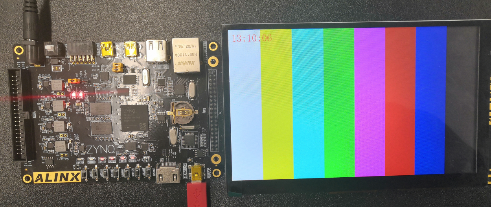

.. image:: images/images_0/88.png  

========================================
《第二十章》7寸液晶屏显示实验
========================================
**实验Vivado工程为“lcd7_test”。**

基于HDMI输出实验,本章介绍7寸液晶屏的显示。

20.1硬件介绍
========================================
AN970 LCD触摸屏模块由TFT 液晶屏,电容触摸屏和驱动板组成,详细信息查看AN970用户手册。AN970实物照片如下:

.. image:: images/images_20/image390.png  
   :align: center

1.LCD屏的驱动时序

LCD屏显示方式从屏幕左上角一点开始,从左向右逐点显示,每显示完一行,再回到屏幕的左边下一行的起始位置,在这期间,需要对行进行消隐,每行结束时,用行同步信号进行同步；LCD的驱动有两种方式,一种为HV模式,另一种为DE模式,这两种模式都能驱动LCD屏,数据在DCLK的上升沿采样。以下为行显示的时序图:

LCD行的显示时序参数如下表所示:

当显示完所有的行,形成一帧,用场同步信号进行场同步,并使LCD显示回到屏幕左上方,同时进行场消隐,开始下一帧。以下为列显示的时序图:

LCD列的显示时序参数如下表所示:

20.2程序设计
========================================
本章实验其实很简单,与HDMI显示最大的不同是不需要rgb转dvi的模块,输出按照RGB即可。以下是文件结构,去掉了rgb2dvi模块。

同时因为液晶屏的分辨率是800x480,需要修改video_define.v的宏定义。

.. image:: images/images_20/image397.png  
   :align: center

同时将PLL的输出时钟频率修改为33MHz,即800x480的像素时钟。

.. image:: images/images_20/image398.png  
   :align: center

同时在top.v中例化了ax_pwm,用于调节液晶屏的亮度,设置为200Hz,30%点空比。

.. image:: images/images_20/image399.png  
   :align: center

20.3实验现象
========================================
连接液晶屏到J11扩展口,下载程序,即可看到彩条显示。

同时也准备了字符显示和RTC显示的例程:

字符显示

RTC显示

.. image:: images/images_0/888.png  

*ZYNQ-7000开发平台 FPGA教程*    - `Alinx官方网站 <http://www.alinx.com>`_
