.. image:: images/images_0/88.png  

========================================
《第三章》PS端MIO的使用
========================================
**实验Vivado工程为“ps_mio”。**

本章介绍PS端MIO的操作,MIO是基础的外设IO,可以连接诸如SPI,I2C,UART,GPIO等,通过VIVADO软件设置,软件可以将信号通过MIO导出,同样也可以将信号通过EMIO连接到PL端的引脚上。

MIO共有两个BANK,BANK0有16个引脚,BANK1为38个引脚,共54个引脚,两个BANK的电压需要注意选择正确。

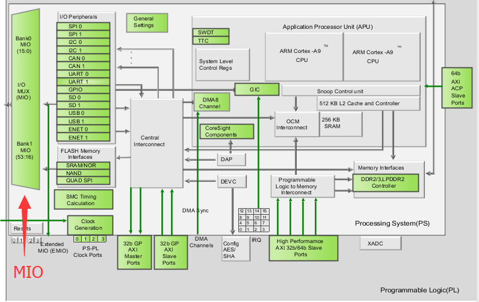

本实验通过实现PS端LED灯的闪烁演示MIO的操作。

3.1原理介绍
========================================
- 先来了解GPIO的BANK分布,在UG585文档GPIO一章中可以看到GPIO是有4个BANK,注意与MIO的BANK区分。
- BANK0控制32个信号,BANK1控制22个信号,总共是MIO的54个引脚,也就是诸如SPI,I2C,USB,SD等PS端外设接口;
- BANK2和BANK3共能控制64个PL端引脚,注意每一组都有三个信号,输入EMIOGPIOI,输出EMIOGPIOO,输出使能EMIOGPIOTN,类似于三态门,共192个信号。可以连接到PL端引脚,通过PS控制信号。

.. image:: images/images_3/image132.png  
   :align: center

3.2Vivado工程建立
========================================
本实验基于 “ps_hello”工程另存为”ps_mio”。如果想要控制PS端的MIO是需要将 GPIO MIO打开的,前面已经配置过。

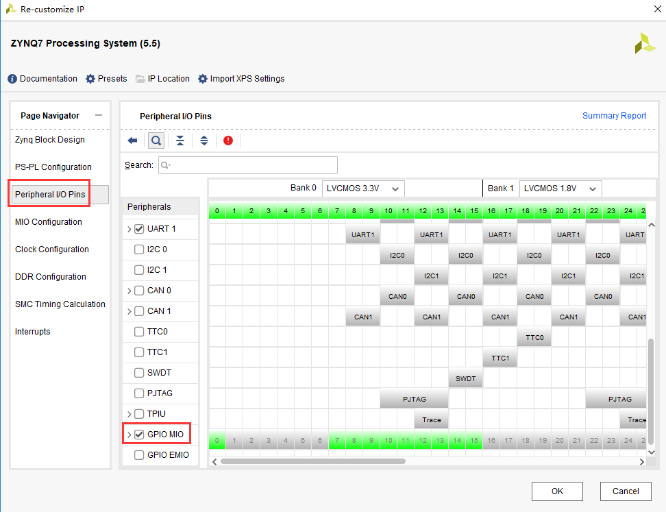

1.由于不需要生成FPGA烧写文件,直接点击FileExportExport Hardware,不用勾选include bitstream选项,生成Hardware信息,此时会生成新的Vitis目录。

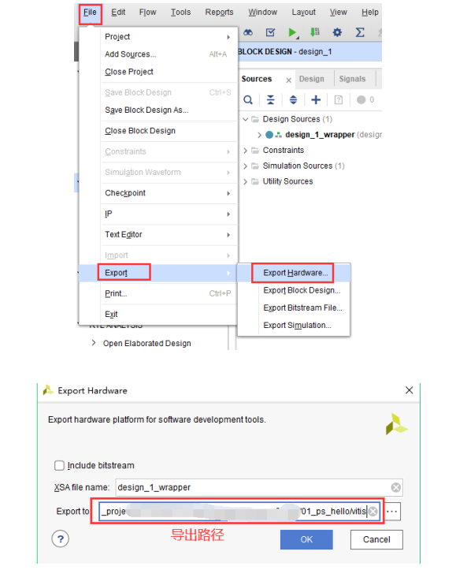

**软件工程师工作内容**
以下为软件工程师负责内容。

3.3Vitis程序开发
========================================
3.3.1 MIO点亮PS端LED灯
-------------------------------
根据原理图得知,AX7020和AX7010的LED灯连接到了PS端的MIO0和MIO13,可以根据相应的开发板MIO的位置控制LED灯。 

.. image:: images/images_3/image134.png  
   :align: center

AX7020/AX7010原理图

1.点击FileLaunch Vitis进入Vitis

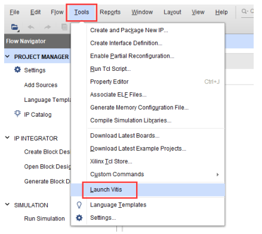

2.新建platform工程过程不再赘述,参考“PS定时器中断实验” 一章

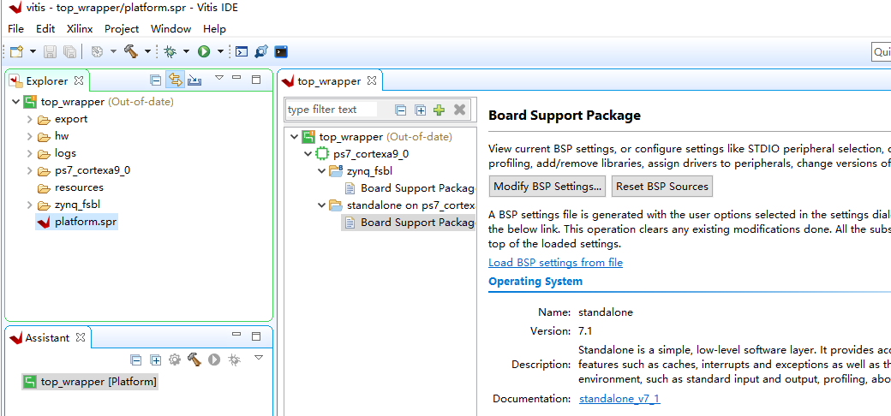

3.下图为GPIO的控制框图,实验中会用到输出部分的寄存器,数据寄存器DATA,数据掩码寄存器MASK_DATA_LSW,MASK_DATA_MSW,方向控制寄存器DIRM,输出使能控制器OEN。

.. image:: images/images_3/image136.png  
   :align: center

4.再来看GPIO的寄存器,可以打开UG585文档的最下面Register Details,找到General Purpose I/O部分。

.. image:: images/images_3/image137.png  
   :align: center

5.实验中可能会用到的寄存器:
数据掩码寄存器,例如MIO 9在GPIO的BANK0,可以屏蔽其他BANK0中的其他31位。

.. image:: images/images_3/image138.png  
   :align: center

方向寄存器,控制数据的方向

.. image:: images/images_3/image139.png  
   :align: center

输出使能寄存器

.. image:: images/images_3/image140.png  
   :align: center

数据寄存器,有效的数据

.. image:: images/images_3/image141.png  
   :align: center

具体的寄存器含义就不一一讲解了,大家自行研究。

6.一开始编写代码可能会无从下手,我们可以导入Xilinx提供的example工程,点开system.mss,找到ps7_gpio_0,点击Import Examples

.. image:: images/images_3/image142.png  
   :align: center

在弹出窗口选择“xgpiops_polled_example”,点击OK

.. image:: images/images_3/image143.png  
   :align: center

会出现一个新的APP工程

.. image:: images/images_3/image144.png  
   :align: center

7.这个example工程是测试PS端MIO的输入输出的,由于开发板PS端的LED是MIO0和MIO13,需要在文件中修改Output_pin为0,测试MIO0的LED灯。 

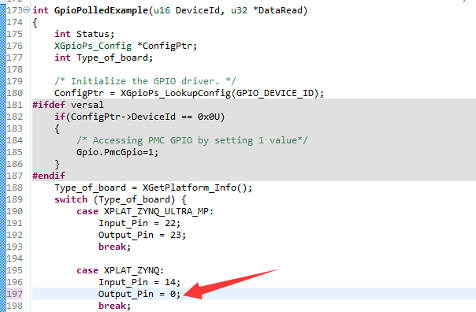

由于只测试LED灯,也就是输出,我们把输入功能注释掉。保存文件。

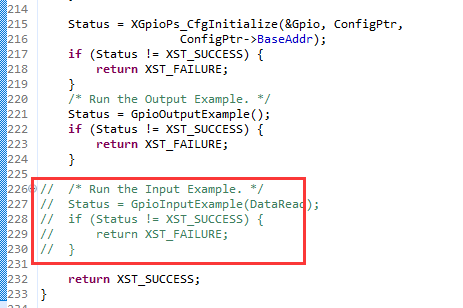

8.编译工程

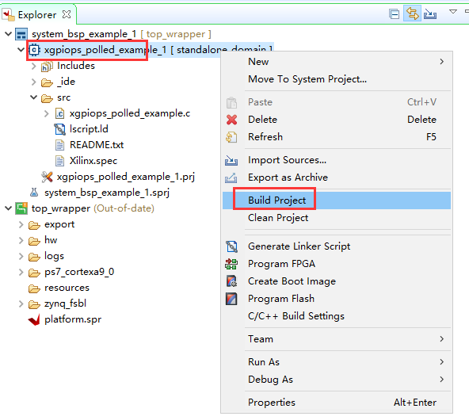

9.Run AsLaunch on Hardware(Single Application Debug),下载结束后,即可看到PS_LED1快速闪烁16次

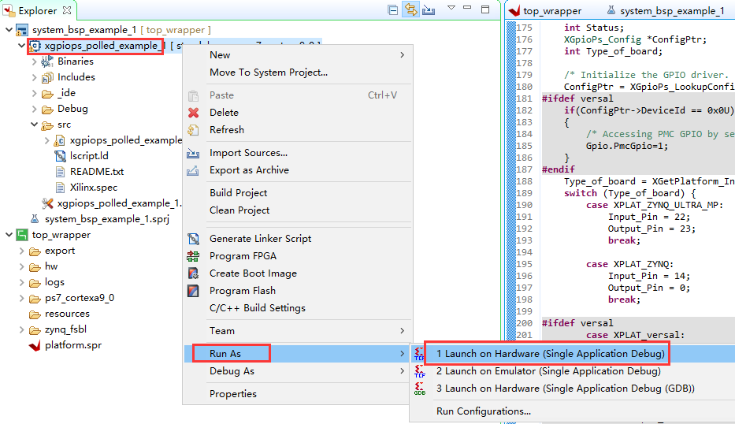

大家也可以改成MIO13观察PS_LED2的变化。

10.虽然用官方的例子比较方便,但是它的代码看起来比较臃肿,我们可以通过学习它的方法,自己简化写一遍。我们新建一个APP工程。可以在空白处右键NewApplication Project。在ps_led_test的helloworld.c中修改。其实程序步骤很简单,初始化GPIO设置方向输出使能控制GPIO输出值。

.. image:: images/images_3/image149.png  
   :align: center

11.选择platform

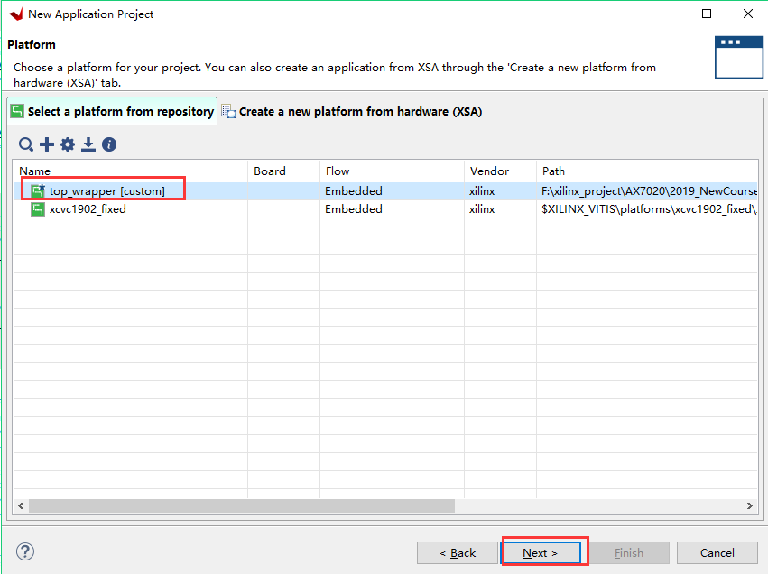

12.选择Domain,Domain的含义类似于BSP

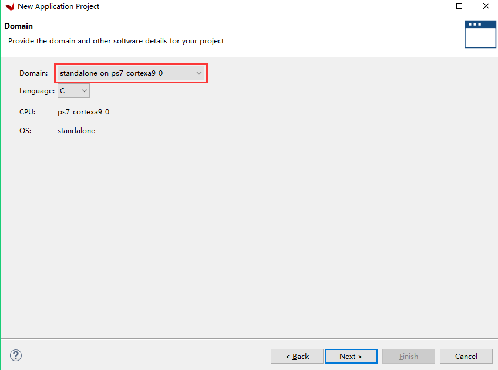

13.模板选择Hellow World即可

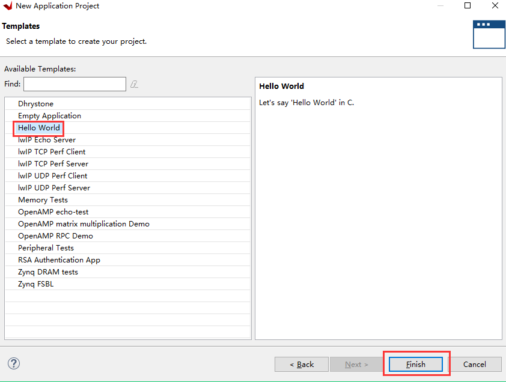

14.可以看到多了一个APP工程,仍然是基于名为standalone on ps7_cortexa9_0的BSP,也就是一个Domain,与前面的example工程共用一个BSP

.. image:: images/images_3/image153.png  
   :align: center

15.可以将例程的代码复制到helloworld.c中,保存并Build Project

.. image:: images/images_3/image154.png  
   :align: center 

16.下载方法与前面一样,就可以看到PS端的LED1和LED2灯开始闪烁。

3.3.2 MIO按键中断
-------------------------------
前面介绍了MIO作为输出控制LED灯,这里讲一下利用MIO作为按键输入控制LED灯。

1.通过UG585文档看下GPIO的结构图,中断的寄存器:

- INT_MASK:中断掩码
- INT_DIS: 中断关闭
- INT_EN: 中断使能
- INT_TYPE: 中断类型,设置电平敏感还是边沿敏感
- INT_POLARITY: 中断极性,设置低电平或下降沿还是高电平或上升沿
- INT_ANY: 边沿触发方式,需要INT_TYPE设置为边沿敏感才能使用

设置中断产生方式时需要INT_TYPE、INT_POLARITY、INT_ANY配合使用。具体寄存器含义请参考UG585 Register Details部分。

.. image:: images/images_3/image155.png  
   :align: center

在原理图中可以看出PS端的按键接在了MIO50和MIO51,本实验采用MIO50

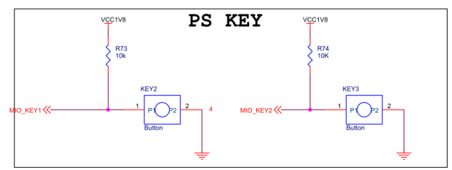

AX7020/AX7010原理图

2.本实验设计为接下按键LED灯亮,再按下LED灭。
主程序设计流程如下:

GPIO初始化 —— 设置按键和LED方向 —— 设置产生中断方式 —— 设置中断 —— 打开中断控制器 —— 打开中断异常 —— 打开GPIO中断 —— 判断KEY_FLAG值,是1,写LED

中断处理流程:

查询中断状态寄存器 —— 判断状态 —— 清除中断 —— 设置KEY_FLAG值

3.新建Vitis工程

.. image:: images/images_3/image157.png  
   :align: center

4.定义PS按键编号为50,PS LED为0

.. image:: images/images_3/image158.png  
   :align: center

5.在main函数中,设置LED和按键,将按键中断类型设置为上升沿产生中断。在本实验中,即按键信号的上升沿产生中断。

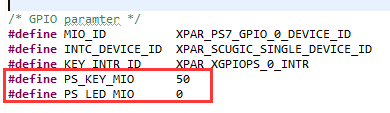

6.中断控制器设置函数IntrInitFuntions是参考PS定时器中断实验所做,而下面的语句是设置中断优先级和触发方式。即操作ICDIPR和ICDICFR寄存器。

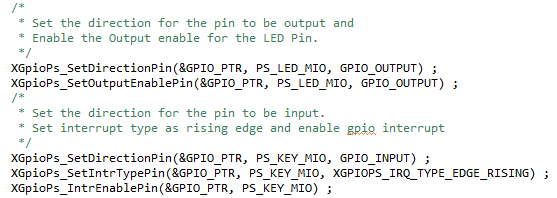

7.在中断服务程序GpioHandler中,判断中断状态寄存器,清除中断,并将按键标志置1。

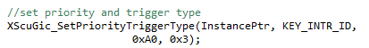

8.在main函数中,判断按键标志key_flag,向LED写入数据。

.. image:: images/images_3/image162.png  
   :align: center

9.编译工程并下载程序

.. image:: images/images_3/image163.png  
   :align: center

10.观察实验现象,按下PS端按键,就可以控制PS端LED的亮灭。

- AX7020/AX7010开发板丝印为PS KEY1;
- PS端LED灯位置: AX7020/AX7010开发板丝印为PS LED1;

3.4知识点分享
========================================
1.在platform中bsp的include文件夹下包含了xilinx的各种头文件,如本章用到的GPIO,用到了xgpiops.h,在此文件中可以看到各种宏定义,在调用GPIO函数时可以使用这些宏定义,提高可读性。

.. image:: images/images_3/image164.png  
   :align: center

同时也包含外设自带的函数声明

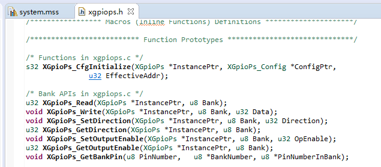

2.在xparameters.h头文件中定义了各个外设的基地址,器件ID,中断等

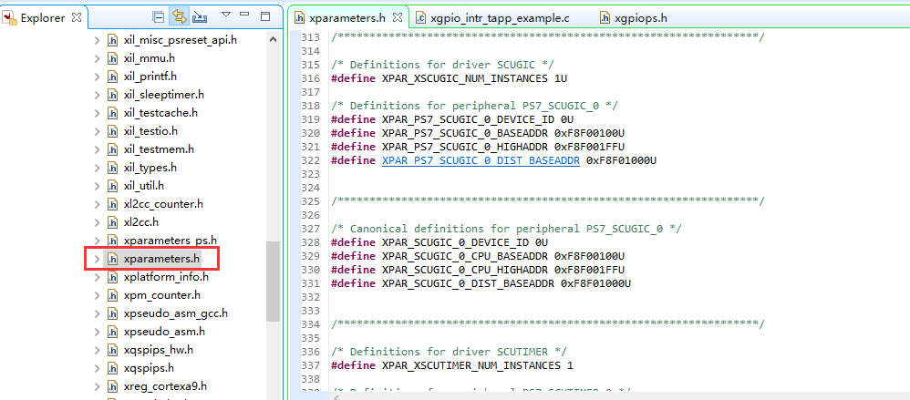

比如程序中的DEVICE_ID宏定义就是在这个文件里找到的。

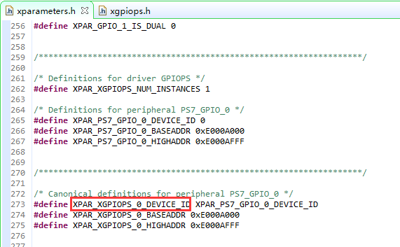

3.在libsrc文件夹中,包含外设函数的定义,使用说明

.. image:: images/images_3/image168.png  
   :align: center

4.在src文件夹下的lscript.ld中,定义了可用memory空间,栈和堆空间大小等,可根据需要修改。

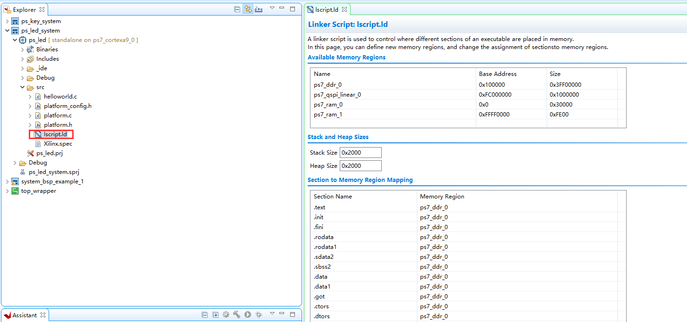

5.把鼠标光标放到宏定义或函数上,按下F3即可看到在哪里定义的,也可以按Ctrl+鼠标左键进入。比如下面的DEVICE_ID即可进入xparameter.h中

.. image:: images/images_3/image170.png  
   :align: center

.. image:: images/images_3/image171.png  
   :align: center

3.5本章小结
========================================
本章介绍了MIO的输入输出控制,以及GPIO的使用,相信大家也有了一定的认识。在学习过程中,一定要多看文档,结合模块结构以及寄存器含义加深理解。参考文档UG585。

.. image:: images/images_0/888.png  

*ZYNQ-7000开发平台 FPGA教程*    - `Alinx官方网站 <http://www.alinx.com>`_