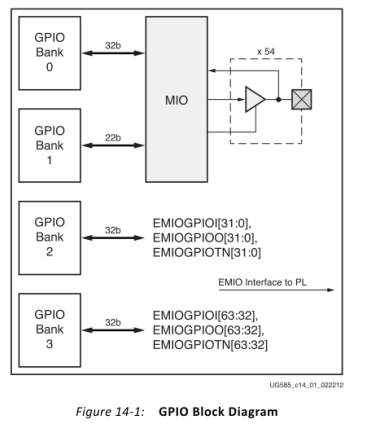
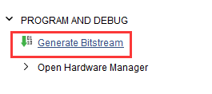
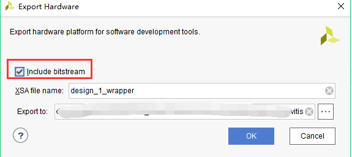
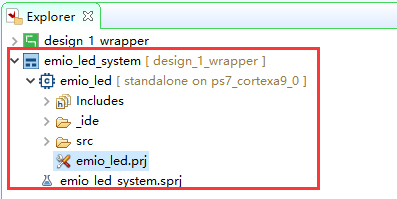
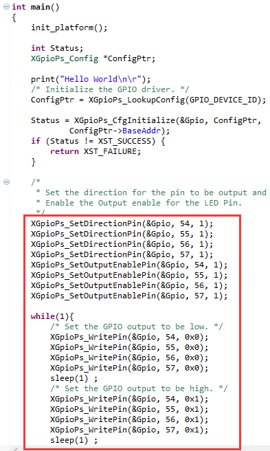
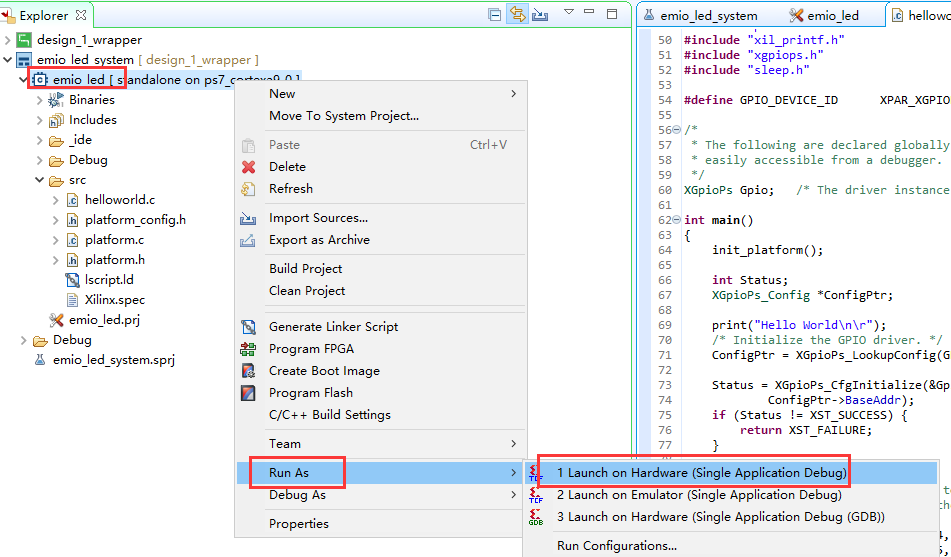
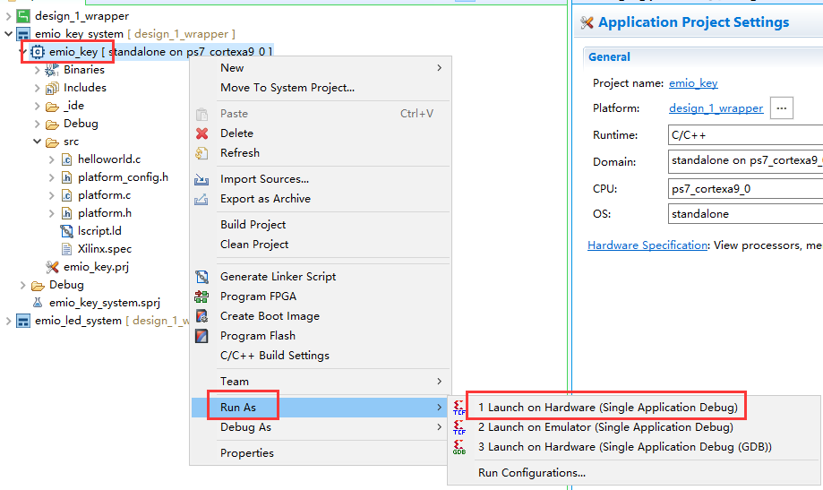
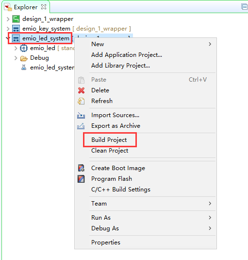

.. image:: images/images_0/88.png  

========================================
《第四章》PS端EMIO的使用
========================================
**实验Vivado工程为“ps_emio”。**

前面介绍了PS端点亮LED灯的实验,但是如果想用PS点亮PL的LED灯,该如何做呢?一是可以通过EMIO控制PL端LED灯,二是通过AXI GPIO的IP实现控制。本章介绍如何使用EMIO控制PL端LED灯的亮灭。同时也介绍了,利用EMIO连接PL端按键控制PL端LED灯。

4.1原理介绍
========================================
前面介绍了PS端MIO的结构如下,从图中可知BANK0和BANK1的MIO有54个。BANK2和BANK3的EMIO有64个,本章就是采用EMIO控制PL端LED。

**FPGA工程师工作内容**

以下为FPGA工程师负责内容。

4.2Vivado工程建立
========================================
1) 以ps_hello工程为基础,另存为一个名为ps_emio的工程,打开ZYNQ配置,把GPIO EMIO勾选上。

.. image:: images/images_4/image172.png  
   :align: center

2) 在MIO配置中选择EMIO的位宽为5位,因为PL端的LED有四个,使用PL端的一个按键。配置结束,点击OK。

.. image:: images/images_4/image173.png  
   :align: center

3) 点击多出的GPIO_0端口右键选择Make External,将端口信号导出

.. image:: images/images_4/image174.png  
   :align: center

4) 修改引脚名称为emio

.. image:: images/images_4/image175.png  
   :align: center

修改结果,并保存设计

.. image:: images/images_4/image176.png  
   :align: center

5) 点击xx.bd右键选择Generate Output Products,重新生成输出文件

.. image:: images/images_4/image177.png  
   :align: center

6) 结束后,顶层文件会更新出新的管脚,下面需要对其进行引脚绑定

.. image:: images/images_4/image178.png  
   :align: center

4.3XDC文件约束PL管脚
========================================
7) 新建XDC文件,绑定PL端引脚

.. image:: images/images_4/image179.png  
   :align: center

设置文件名称为emio

.. image:: images/images_4/image180.png  
   :align: center

8) emio.xdc添加一下内容,端口名称一定要和顶层文件端口一致

::

 set_property IOSTANDARD LVCMOS33 [get_ports {emio_tri_io[*]}]
 #pl led
 set_property PACKAGE_PIN M14 [get_ports {emio_tri_io[0]}]
 set_property PACKAGE_PIN M15 [get_ports {emio_tri_io[1]}]
 set_property PACKAGE_PIN K16 [get_ports {emio_tri_io[2]}]
 set_property PACKAGE_PIN J16 [get_ports {emio_tri_io[3]}]
 #pl key
 set_property PACKAGE_PIN N15 [get_ports {emio_tri_io[4]}]

9) 生成bit文件

10) 导出硬件,因为要用到PL,所以选择“Include bitstream”,点击“OK”

**软件工程师工作内容**

以下为软件工程师负责内容。

4.4 Vitis程序编写
========================================
4.4.1 EMIO点亮PL端LED灯
-------------------------------
1) 进入Vitis软件,新建名为emio_led的工程

2) 代码部分与PS端MIO操作点亮LED类似,由于MIO的编号是0~53,因此EMIO的编号是从54开始的,只要做以下修改即可

3) 下载配置

即可看到PL端LED闪烁。

4.4.2 EMIO实现PL端按键中断
-------------------------------
通过PL端的按键控制PL端LED灯的亮灭

1)新建名为emio_key的工程,模板为hello world,拷贝例程的程序,保存并编译

.. image:: images/images_4/image186.png  
   :align: center

1) 由PS端MIO的使用的MIO按键中断程序移植过来,并修改按键的编号为58,LED灯编号为54,保存重新生成elf。

.. image:: images/images_4/image187.png  
   :align: center

2) 下载程序

11.观察实验现象,按下PL端按键,就可以控制PL端LED的亮灭。

AX7020/AX7010开发板丝印为PL KEY1;

PL端LED灯位置: AX7020/AX7010开发板丝印为PL LED1;

4.5固化程序
========================================
前面介绍过没有FPGA加载文件情况下如何生成固化程序(详情参考“体验ARM,裸机输出”Hello World”一章) 。本章内容生成了FPGA的加载文件,在这里演示一下如何生成固化程序。
与前面一样,也是点击system,右键Build Project即可

.. image:: images/images_4/image190.png  
   :align: center

软件会自动添加三个文件,第一个引导程序fsbl.elf,第二个为FPGA的bitstream,第三个为应用程序xx.elf,下载方法与前面一样,不再赘述。

4.6引脚绑定常见错误
========================================
1) 在block design设计中,比如下图,GPIO模块的引脚名设置为了leds和keys,很多人想当然的在XDC里按照这样的名称绑定引脚。

.. image:: images/images_4/image191.png  
   :align: center

如果打开顶层文件就会发现引脚名称是不一样的,一定要仔细检查,以顶层文件里的引脚名称为准。

.. image:: images/images_4/image192.png  
   :align: center

否则就会出现以下引脚未绑定的错误

.. image:: images/images_4/image193.png  
   :align: center

2) 如果是手写XDC文件,切记注意空格,这也是非常常见的错误

.. image:: images/images_4/image194.png  
   :align: center

4.7本章小节
========================================
本章进一步学习了PS端的EMIO的使用,虽然将EMIO连接到了PL端的引脚上,但Vitis中的用法还是一样的,从这个例子我们也可以看出,一旦与PL端发生了联系,就需要生成bitstream,虽然几乎没有产生逻辑。

.. image:: images/images_0/888.png  

*ZYNQ-7000开发平台 FPGA教程*    - `Alinx官方网站 <http://www.alinx.com>`_