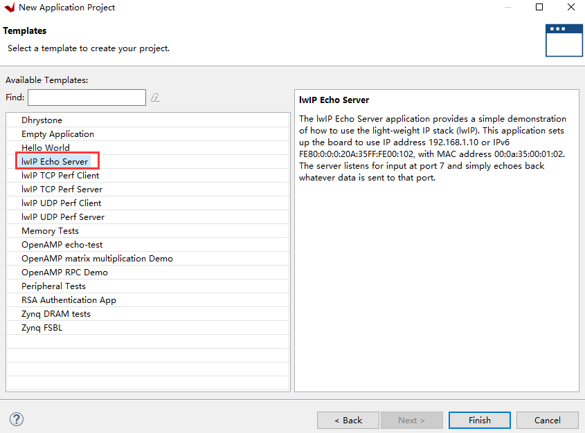
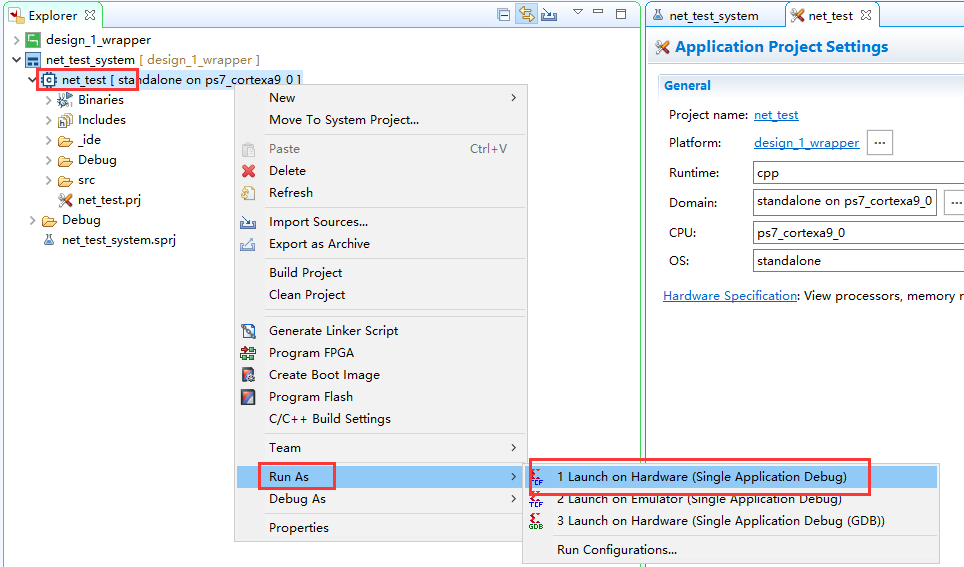
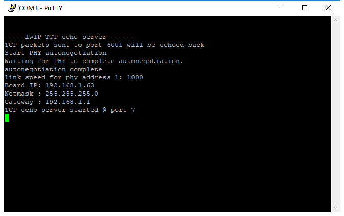
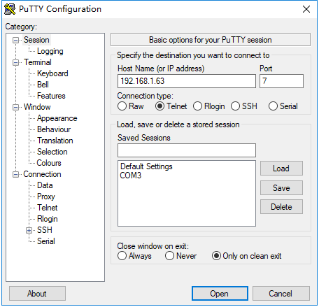
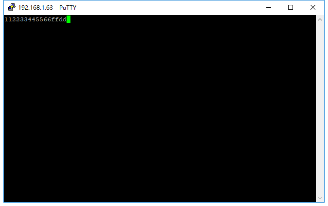

.. image:: images/images_0/88.png  

========================================
《第六章》以太网实验(LWIP)
========================================
**实验Vivado工程为“net_test”。**

开发板有1路千兆以太网,通过RGMII接口连接,本实验演示如何使用Vitis自带的LWIP模板进行千兆以太网TCP通信。

LWIP虽然是轻量级协议栈,但如果从来没有使用过,使用起来会有一定的困难,建议先熟悉LWIP的相关知识。

6.1Vivado工程建立
========================================
基于“ps_hello”另存为一个“net_test”vivado工作。PS端Ethernet 0已经配置过。

6.2Vitis程序开发
========================================
6.2.1 创建APP工程时基于LWIP模板
-------------------------------

6.3下载调试
========================================
测试环境要求有一台支持dhcp的路由器,开发板连接路由器可以自动获取IP地址,实验主机和开发板在一个网络,可以相互通信。

6.3.1 以太网测试
-------------------------------
1) 连接串口打开串口调试终端,连接好PS端以太网网线到路由器,运行Vitis

2) 可以看到串口打印出一些信息,可以看到自动获取到地址为“192.168.1.63”,连接速度1000Mbps,tcp端口为7

3) 使用telnet连接

4) 当输入一个字符时,开发板返回相同字符

6.4实验总结
========================================
通过实验我们更加深刻了解到Vitis程序的开发,本实验只是简单的讲解如何创建一个LWIP应用,LWIP可以完成UDP、TCP等协议,在后续的教程中我们会提供基于以太网的具体应用,例如ADC采集数据通过以太网发送,摄像头数据通过以太网发送上位机显示。

.. image:: images/images_0/888.png  

*ZYNQ-7000开发平台 FPGA教程*    - `Alinx官方网站 <http://www.alinx.com>`_
