.. image:: images/images_0/88.png  

========================================
《第九章》XADC的使用
========================================
**实验Vivado工程为“ps_xadc”。**

本章介绍XADC的使用,XADC内嵌在PS端,允许CPU或其他主机连接XADC,而不用使用PL端。XADC最大采样率为1MSPS,精度为12bits,内置电压和温度传感器,可监测芯片的电压及温度信息。如图所示电压传感器可监测芯片的VCCINT,VCCAUX,VCCBRAM等,VP_0和VN_0为一对专用的ADC模拟输入口。VAUXP[*]和VAUXN[*]也是ADC输入口,但是不用作ADC输入口时,可用作普通IO使用。在AX7015/AX7021/AX7010/AX7020/AX7Z035/AX7Z100开发板上这些引脚均未引出。因此本实验主要测量温度传感器Temperature Sensor以及电压传感器Supply Sensors的值。

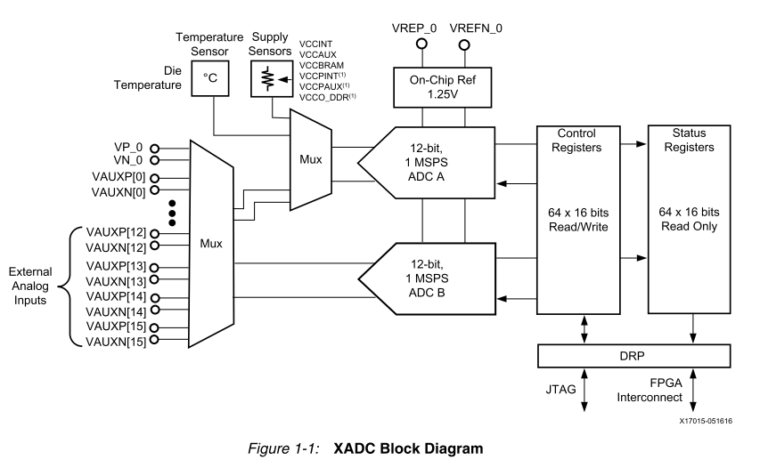

本实验介绍三种读取传感器信息值的方法。首先需要新建Vivado工程,同样以“ps_hello”工程为基础,另存一个工程,不再赘述。

9.1Hardware读取XADC
========================================
1. 打开工程,连接好开发板电源,JTAG下载器,并将开发板调整为JTAG模式,开发板上电,点击Open Hardware Manager,再点击Auto Connect,发现硬件。

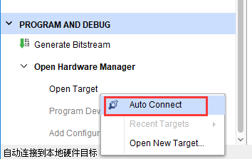

2. 右键选中XADC,新建Dashboard

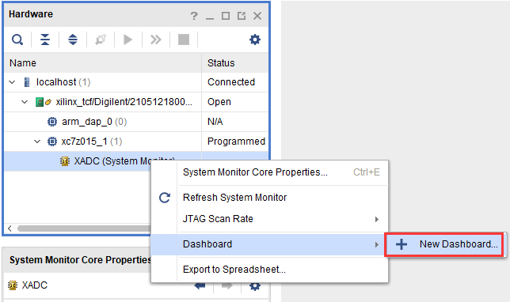

3. 修改名称,点击OK

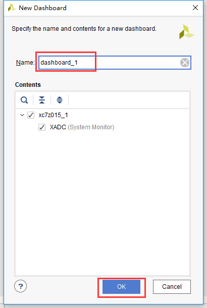

4. 默认会有温度信息

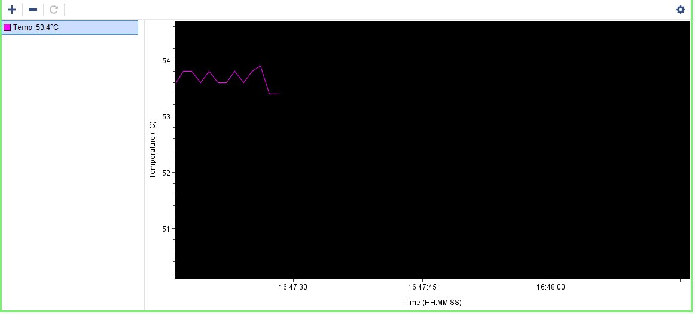

5. 点击+将电压值添加到窗口

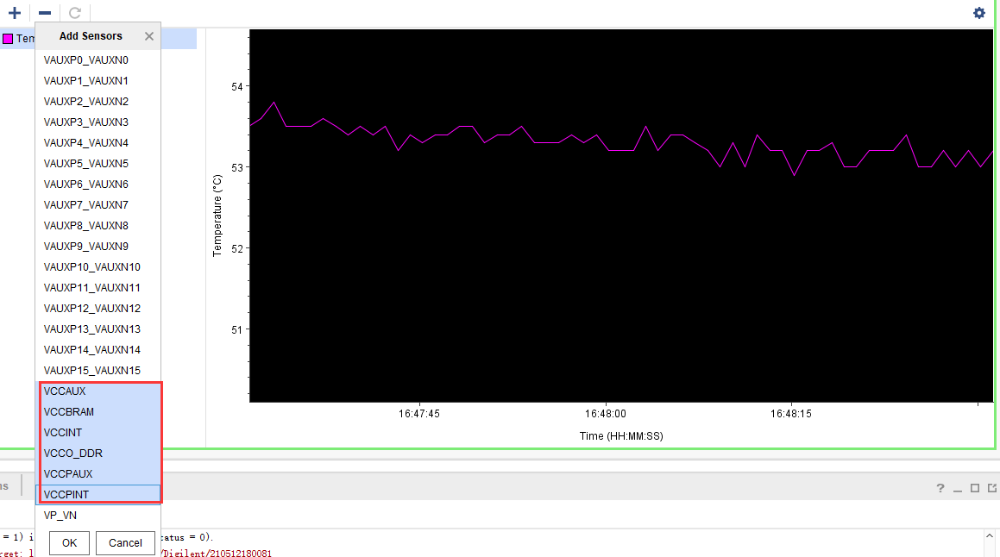

6. 显示如下

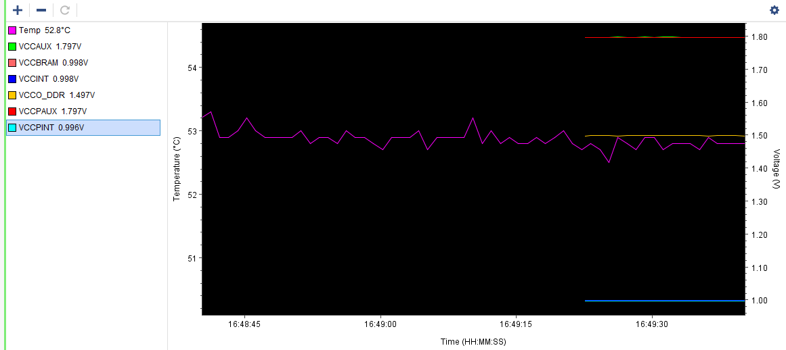

此方法优点是图形化显示,较为直观,但缺点是无法得到数据值。下面介绍PS读取XADC信息。

9.2PS读取XADC信息
========================================
1. 打开Vitis软件,新建Vitis工程,已经为大家准备好了程序,可拷贝到新的工程

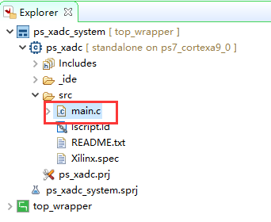

2. 可以在BSP中看到PS自带有XADC外设

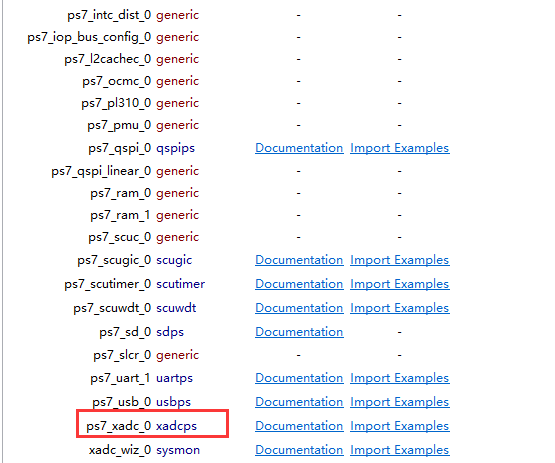

3. 在本实验中主要用到xadcps.h和xadcps_hw.h

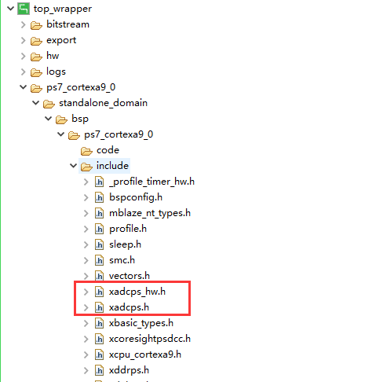

4. 此实验现象为读取温度和电压的数据,并每隔1S通过串口打印出来。通过XAdcPs_GetAdcData函数读取原始值,用XAdcPs_RawToTemperature宏将ADC值转换为温度值。用XAdcPs_RawToVoltage转换为电压值。

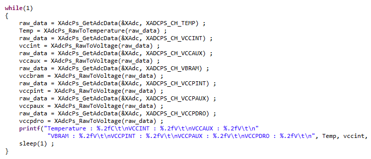

5. Run as下载后在串口工具中可看到打印信息如下:

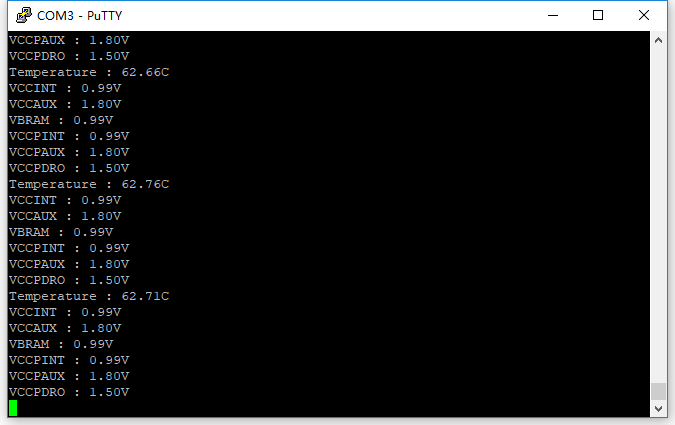

此方法简单方便,可以读取数据信息,但是其信号对于PL端来说是不可见的,灵活性差些。参考资料UG585,UG480。下面再介绍AXI总线方式读取数据。

9.3AXI总线读取XADC信息
========================================
前面PS端读取XADC实验是通过查询的方式读取,本小节实验我们想在查询的基础上,添加中断,监测温度是否超过一定温度,如果超过了,就产生中断。
1. 添加XADC模块,按照默认点击Run Connection Automation

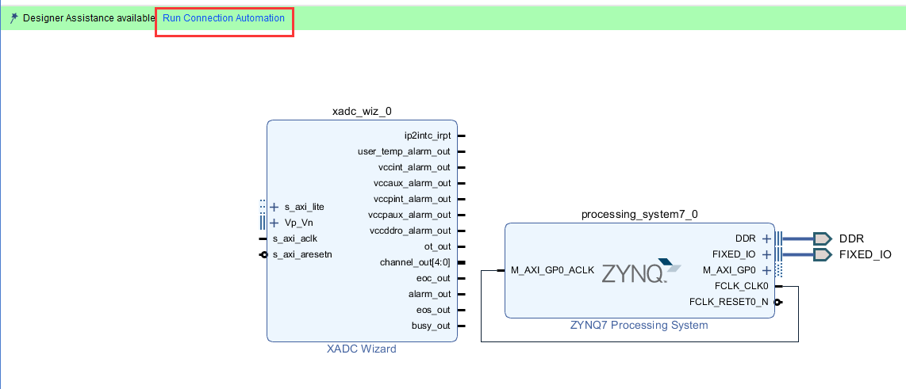

2. 重新配置Zynq CPU,添加PL端中断,点击OK完成

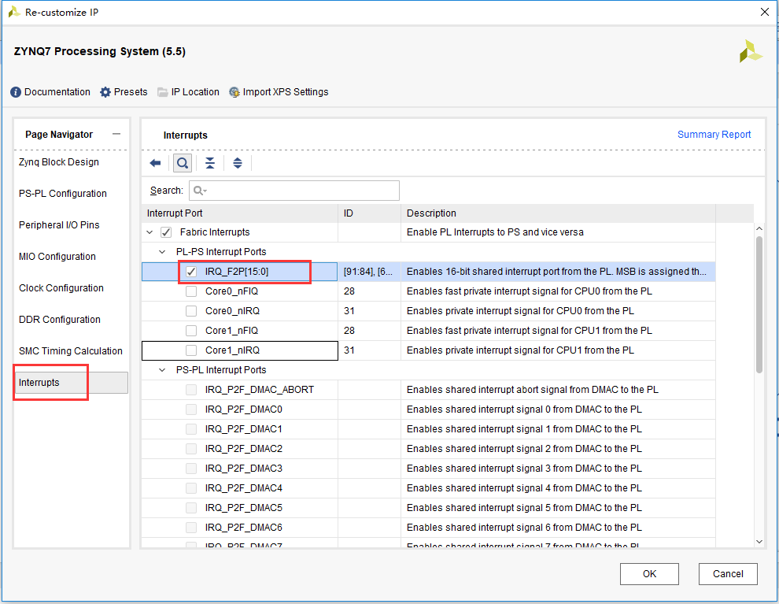

3. 连接XADC中断到CPU中断口,重新Generate Output Products,此次需要生成Bitstream

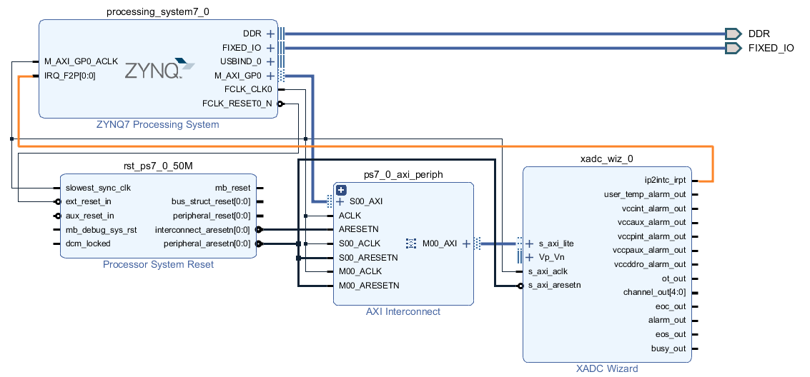

点击Generate Bitstream,生成FPGA下载文件。

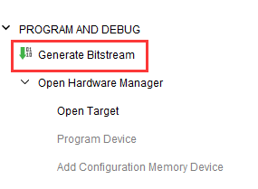

4. 重新Export Hardware,在这里在选中Include bitstream

.. image:: images/images_9/image330.png  
   :align: center

5. XADC有很多报警信号alarm,如温度,电压等,此实验通过设置XADC的温度的Temp Upper和Temp Lower值,设置中断,一旦温度超过Temp Upper的值,就会触发中断

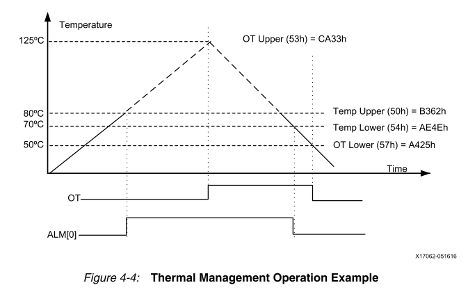

温度值与ADC Code值换算关系式如下,程序中有现成的公式可用

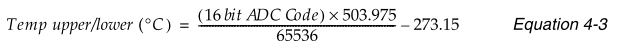

6. 新建Vitis工程

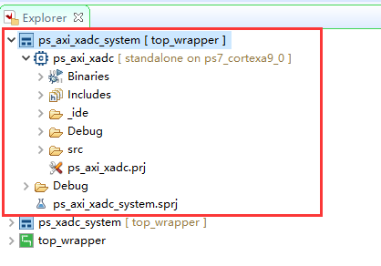

7. 在BSP里多了一个模块,也就是刚才添加的XADC模块,用到了sysmon.h和sysmon_hw.h头文件。

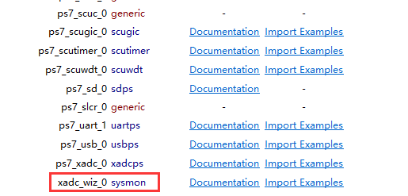

8. 以下为设置温度的upper和lower值,打开全局中断和温度中断,中断寄存器可以在PG091文档中找到

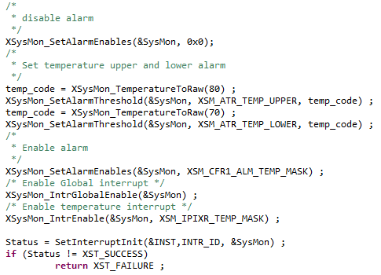

温度中断使能为ALM[0],打开此中断即可

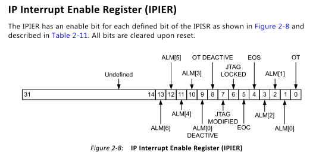

XSysMon_IntrGlobalEnable();  全局中断使能函数
XSysMon_IntrEnable();  中断使能函数,可使用MASK宏定义来确定需要打开的中断

9. 中断服务程序中使用XsysMon_IntrGet_Status();函数读取中断状态寄存器,确定是否是温度中断,打印信息,最后使用XSysMon_IntrClear();函数清除中断

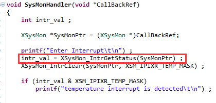

10. 程序中设置Upper为80摄氏度,在高于80度后会触发一次中断,等温度降到lower温度后,如果温度再次上升到Upper温度之上,又会触发中断。如下串口所示。

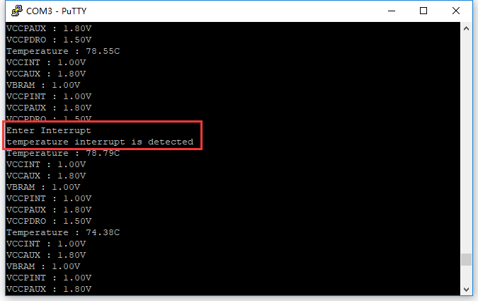

当然还有其他许多报警,可以通过配置Alarm Threshold寄存器和中断寄存器实现不同的监测功能。

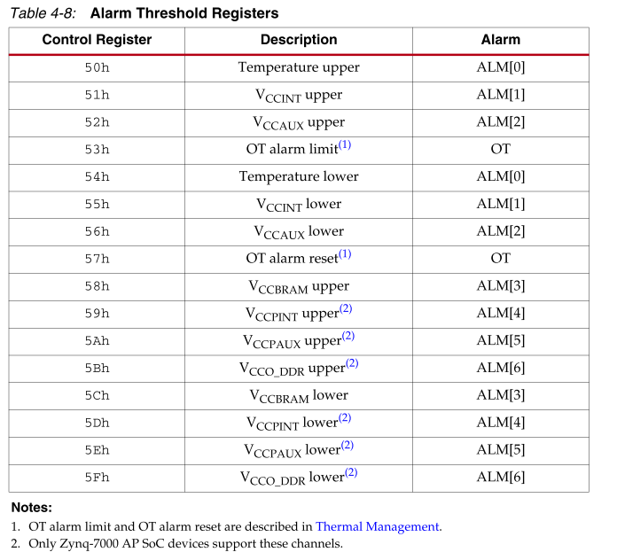

此种方法不但可以访问温度和电压传感器,还可以在PL端进行访问,本章不再做讲解。

9.4本章小结
========================================
本章介绍了三种读取XADC的方法,各有优缺点,用户可根据需求选择需要的方式。

.. image:: images/images_0/888.png  

*ZYNQ-7000开发平台 FPGA教程*    - `Alinx官方网站 <http://www.alinx.com>`_
