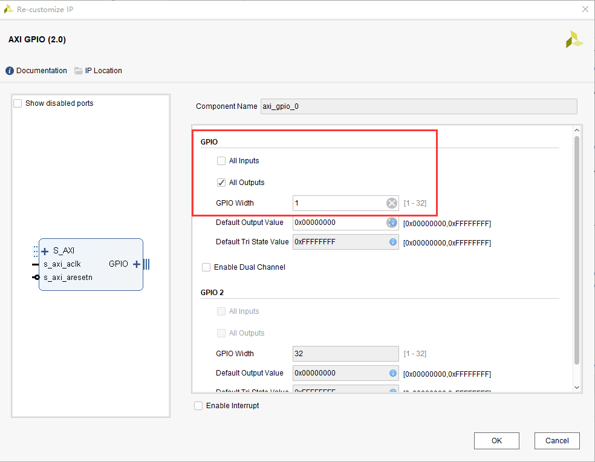
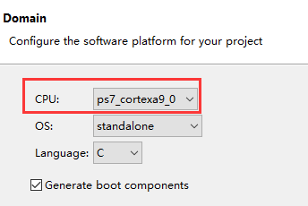
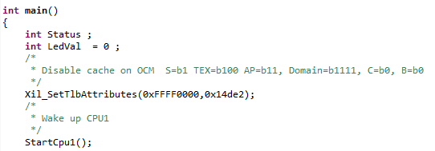

.. image:: images/images_0/88.png  

========================================
《第十章》双核AMP的使用
========================================
**实验Vivado工程为“dualcore_amp”。**

前面的例程都是采用的单核CPU,在有些情况下,比如多任务处理,并行处理等,需要用到双核CPU,本章将简单介绍双核的使用方法。并将实现以下功能：

1. CPU0实现PS端按键中断,控制PS端LED的亮灭,并向CPU1发出软件中断,让CPU1打印CPU0内存空间的一串字符
2. CPU1实现PL端按键中断,控制PL端LED的亮灭,并向CPU0发出软件中断,让CPU0打印CPU1内存空间的一串字符
3. 内存空间的划分,共享内存空间的使用
4. FSBL启动Flash

参考文档为XAPP1079,裸机下双核应用。名词解释：

- AMP: 非对称多处理,每个CPU内核运行一个独立的操作系统或同一操作系统的独立实例
- SMP: 对称多处理,一个操作系统实例可以管理所有CPU内核,且应用并不绑定某一内核
- BMP: 混合多处理,一个操作系统实例可以同时管理所有CPU内核,但每个应用被锁定于某个指定的核心。
  
10.1硬件环境搭建
========================================
1. 本实验以“ps_hello”例程为基础,添加PL端的GPIO。添加axi_gpio_0设置为输出,位宽为1位,连接PL端LED。

2. 添加axi_gpio_1,连接PL端按键,设置为输入,位宽为1位,并使能中断
 

3. 连接后的结果如下,将axi_gpio_1的中断输出连接到CPU的IRQ_F2P端口
 
.. image:: images/images_10/image342.png  
   :align: center

4. 配置打开GPIO EMIO(AX7Z035和AX7Z100开发板比较特殊,没有PS端按键和LED灯,需要配置EMIO控制PL端按键和LED灯,其他板卡不需要打开此项）

.. image:: images/images_10/image343.png  
   :align: center

并将EMIO宽度设置为2,一个用来控制按键,一个控制LED灯

.. image:: images/images_10/image344.png  
   :align: center

将其导出,并修改名称

.. image:: images/images_10/image345.png  
   :align: center

5. Generate Outputs

.. image:: images/images_10/image346.png  
   :align: center

6. 绑定按键和LED灯的引脚,生成bitstream

.. image:: images/images_10/image347.png  
   :align: center

10.2Vitis程序开发
========================================
10.2.1 CPU0 Vitis工程建立
-------------------------------
1. 新建工程,注意CPU选择ps7_cortexa9_0,也就是CPU0

2. 已经为大家准备好代码,cpu0_app.c和share.h,share.h内包含共享内存结构体,后面会讲到。

3. 在lscript.ld里设置CPU0的访问空间,例如DDR3为1GByte,将CPU0空间设置为一半,当然也可以根据需要修改。 **注意AX7010的DDR3内存为512MB,AX7020/AX7015/AX7021的DDR3内存为1GB,因此设置双核内存空间时注意区分,可参考提供的例程。**

.. image:: images/images_10/image350.png  
   :align: center

10.2.2 CPU1 Vitis工程建立
-------------------------------
1. 在新建CPU1的APP工程之前,我们可以先新建一个基于CPU1的Domain,也就是所谓的BSP,在platform.spr中点击“+”

.. image:: images/images_10/image351.png  
   :align: center

2. 填入名称,并且Processor选择ps7_cortexa9_1,也就是CPU1,点击OK
 
.. image:: images/images_10/image352.png  
   :align: center

3. 新建CPU1工程的时候,选择新建好的Domain

4. 同样也准备了代码,cpu1_app.c和share.h

5. 设置CPU1内存空间,注意不要与CPU0重合,最后保留了256字节的空间,用于共享内存

.. image:: images/images_10/image355.png  
   :align: center

6. 点击CPU1的BSP设置

.. image:: images/images_10/image356.png  
   :align: center

7. CPU1的BSP设置界面,在extra_compile_flags内添加-DUSE_AMP=1,使其支持双核工作

.. image:: images/images_10/image357.png  
   :align: center

编译CPU0和CPU1的APP工程

10.2.3 CPU0程序介绍
-------------------------------
1. 在cpu0_app.c文件中,设置了一个字符数组Cpu0_Data,存放在CPU0访问空间,指针Cpu1Data用于指向CPU1内的字符数组。

.. image:: images/images_10/image358.png  
   :align: center

2. 在程序中,需要CPU0唤醒CPU1,可以在UG585文档看到相关解释,第一步是向0Xffffffff0地址写入CPU1的访问内存基地址,在本实验中也就是0x20000000,第二步是通过SEV指令唤醒CPU1并且跳转到相应的程序。

.. image:: images/images_10/image359.png  
   :align: center

CPU1STARTMEM即在lscript.ld里设置的CPU1 base address

3. 在main函数中,首先利用Xil_SetTlbAttributs函数关闭访问OCM的Cache,笔者认为0Xfffffff0地址在OCM地址内,关闭Cache,可以减少维护两个CPU访问OCM的一致性问题。笔者试验过不加此函数,FLASH启动后,CPU1不工作。可参考XAPP1079文档。

4. 之后是进行中断初始化,PS GPIO的设置。软件中断使用ID号1和2。

并连接中断号1到软件中断服务函数。

.. image:: images/images_10/image363.png  
   :align: center

5. 在while循环语句中,将字符数组的地址和长度赋给共享结构体,这里要提一下共享内存结构体,在share.h中定义了结构体ShareMem,用于在共享内存中传递信息。

并且双核约定好共享地址,这样就能传递参数。

通过XScuGic_SoftwareIntr函数触发中断号2的软件中断。这个函数的第三个参数是CPU号,但要注意CPU号不是简单的0,1,2等,而是每一位指代一个CPU号,可以参考UG585寄存器表mpcore中ICDIPTR的解释,0bxxxxxxx1指向CPU0,0bxxxxxx1x指向CPU1,因此本程序中设置CPU1号的值为0x2

.. image:: images/images_10/image367.png  
   :align: center

6. 在while循环中判断有来自CPU1的软件中断,打印出来CPU1内存空间中的字符串。

10.2.4 CPU1程序介绍
-------------------------------
1. 在CPU1程序中同样有一个字符数组,Cpu0Data指向CPU0内存空间的字符串地址。

2. 在main函数中首先也是关闭OCM的Cache

3. 在PLGpioSetup函数中需要将按键中断号绑定到CPU1,其他部分都与CPU0类似,不再赘述。

10.3板上验证
========================================
1. 下载时注意进入Run Configurations配置

2. 双击Single Application Debug

3. 勾选CPU1,其他默认,点击Run

4. 打开串口软件,测试CPU0,按下按键,控制LED灯亮,表明CPU0在运行,同时CPU1接收到CPU0设置的软件中断,并打印出信息。(AX7015开发板为PS_KEY和PS_LED;AX7021开发板为KEY1和LED1;AX7020/AX7010开发板为PS KEY1和PS LED1; AX7Z035/AX7Z100开发板为KEY1和LED1）

.. image:: images/images_10/image375.png  
   :align: center

5. 测试CPU1,按下按键,控制PL端LED灯亮,表明CPU1在运行,同时CPU0接收到CPU1设置的软件中断,并打印出信息。(AX7015开发板为PL_KEY和PL_LED4;AX7021开发板为KEY2和LED2;AX7020/AX7010开发板为PL KEY1和PL LED1;AX7Z035/AX7Z100开发板为KEY2和LED2）

10.4QSPI Flash启动
========================================
生成BOOT.BIN的方式与前面Build Porject生成不同,我们需要进行配置。在CPU0的system右键选择Create Boot Image

点击Add,添加CPU1的elf文件,

Partition type选择datafile

添加后结果如下,点击Create Image

10.5本章小结
========================================
本章较为简单的介绍了如何在裸机下使用双核,以及中断使用,双核之间通信。在本实验中并未用到共享内存结构体中的长度成员,大家可以试验根据长度和地址将两个核的数据进行拷贝。

**注意AX7010的DDR3内存为512MB,AX7020/AX7015/AX7021的DDR3内存为1GB,因此设置双核内存空间时注意区分,可参考提供的例程。**

.. image:: images/images_0/888.png  

*ZYNQ-7000开发平台 FPGA教程*    - `Alinx官方网站 <http://www.alinx.com>`_