.. image:: images/images_0/88.png  

========================================
《第十八章》DMA使用之ADC示波器(AN9238)
========================================
**实验Vivado工程为“ad9238_dma_hdmi”。**

18.1硬件介绍
========================================
18.1.1 两通道AD模块说明
-------------------------------
黑金高速AD模块AN9238为2路65MSPS, 12位的模拟信号转数字信号模块。模块的AD转换采用了ADI公司的AD9238芯片, AD9238芯片支持2路AD输入转换,所以1片AD9238芯片一共支持2路的AD输入转换。模拟信号输入支持单端模拟信号输入,输入电压范围为-5V~+5V,接口为SMA插座。

模块有一个标准2.54mm间距的40针的排母,用于连接FPGA开发板, AN9238模块实物照片如下:

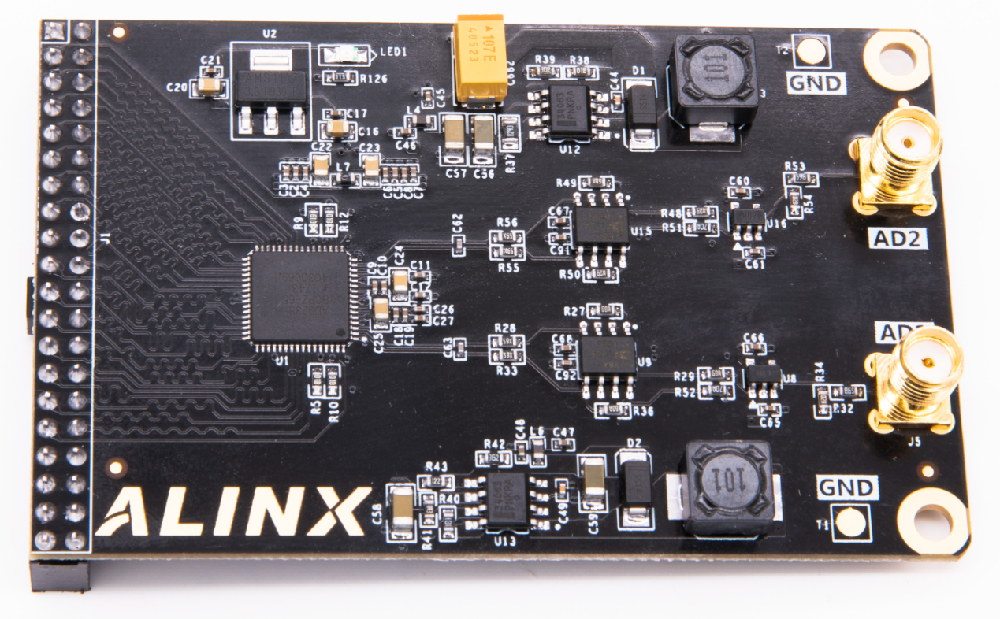

AN9238模块实物图

**参数说明**

以下为AN9238 高速AD模块的详细参数:

- AD转换芯片:1片AD9238
- AD转换通道:2路;
- AD采样速率: 65MSPS;
- AD采样数据位数: 12位;
- 数字接口电平标准:+3.3V的CMOS电平
- AD模拟信号输入范围:-5V~+5V;
- 模拟信号输入接口:SMA接口;
- 测量精度:10mV左右;
- 工作温度:-40°~85°;

18.1.2 模块功能说明
-------------------------------
AN9238模块的原理设计框图如下:

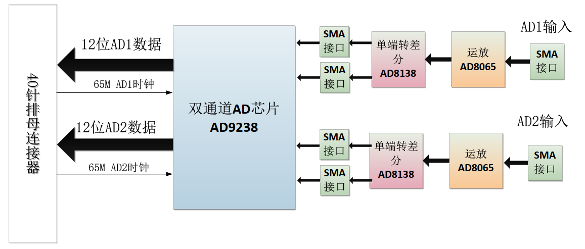

关于AD9238的电路具体参考设计请参考AD9238的芯片手册。

1) 单端输入及运放电路

单端输入AD1和AD2通过J5或者J6两个SMA头输入,单端输入的电压为-5V~+5V。

板上通过运放AD8065芯片和分压电阻把-5V~+5V输入的电压缩小成-1V~+1V。如果用户想输入更宽范围的电压输入只要修改前端的分压电阻的阻值。

.. image:: images/images_18/image600.png  
   :align: center

下表为模拟输入信号和AD8065运放输出后的电压对照表:

.. csv-table:: 
  :header: "AD模拟输入值", "AD8065运放输出"
  :widths: 20 ,30

  "-5V	","-1V"
  "0V	   ","0V "
  "+5V	","+1V"

2) 单端转差分及AD转换

-1V~+1V的输入电压通过AD8138芯片转换成差分信号(VIN+ - VIN-), 差分信号的共模电平由AD的CML管脚决定。

.. image:: images/images_18/image601.png  
   :align: center

下表为模拟输入信号到AD8138差分输出后的电压对照表:

.. csv-table:: 
  :header: "AD模拟输入值", "AD8065运放输出", "AD8138差分输出(VIN+-VIN-)"
  :widths: 30, 30, 20

  "-5V	",-1V	 ,"-1V"
  "0V	   ",0V	 ,"0V "
  "+5V	",+1V	 ,"+1V"

3) AD9238转换

默认AD是配置成offset binary的,AD转换的值如下图所示:

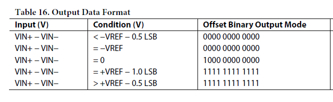

在模块电路设计中,AD9238的VREF的值为1V,这样最终的模拟信号输入和AD转换的数据如下:

.. csv-table:: 
  :header: "AD模拟输入值","AD8055运放输出","AD8138差分输出(VIN+-VIN-)","AD9238数字输出"
  :widths: 30,30,30,20

  "-5V	",-1V	,-1V	,"000000000000"
  "0V	   ",0V	,0V	,"100000000000"
  "+5V	",+1V	,+1V	,"11111111111 "

从表中我们可以看出,-5V输入的时候,AD9238转换的数字值最小,+5V输入的时候,AD9238转换的数字值最大。

4) AD9238数字输出时序

AD9238双通道AD的数字输出为+3.3V的CMOS输出模式,2路通道(A和B)独立的数据和时钟。AD数据在时钟的上降沿转换数据,FPGA端可用AD时钟的采样AD数据。

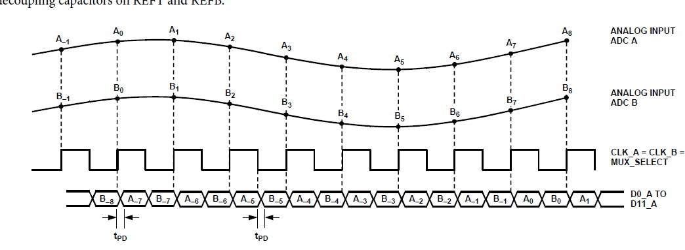

18.2硬件环境搭建
========================================

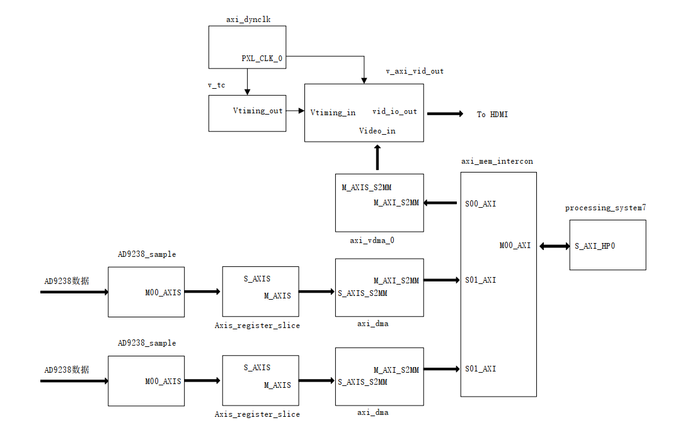

1. 基于AN108的工程搭建硬件环境,删除ad9280_sample模块,由于是两个AD9238通路,需要添加两个ad9238_sample模块,IP核在repo文件夹。

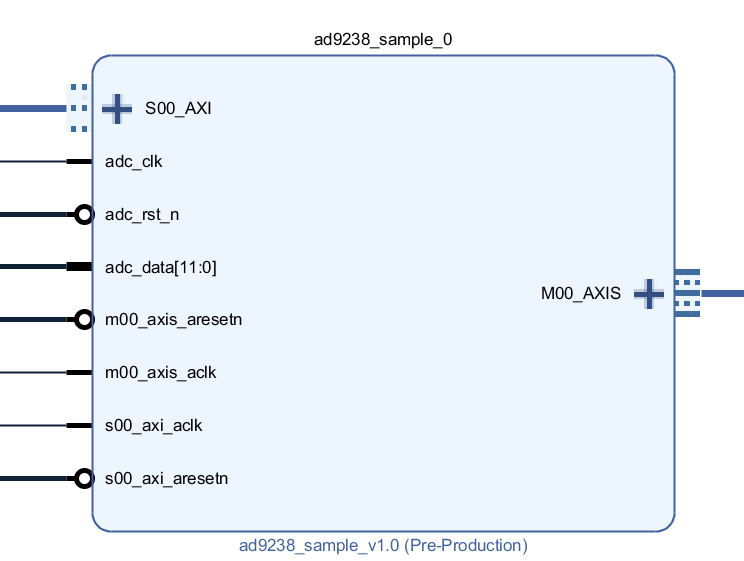

2. 再添加一个DMA模块,将两个DMA的Buffer Length改为23,Memory Map DataWidth修改为64,提高带宽。两个模块配置如下:

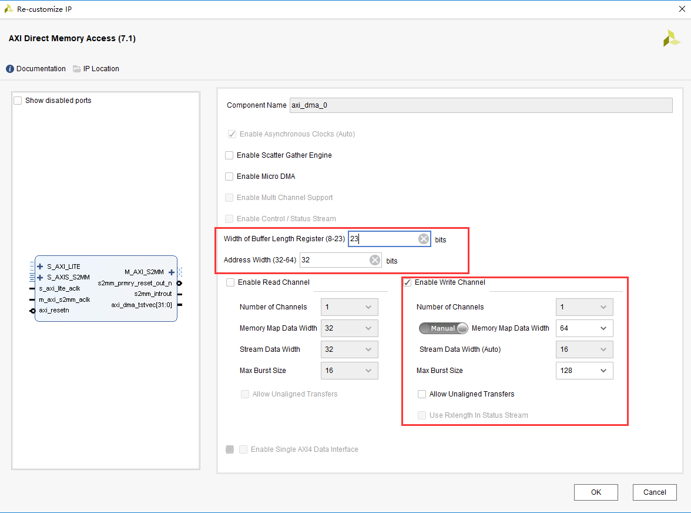

3. 添加一个接口到Concat模块,连接到新添加的dma中断口

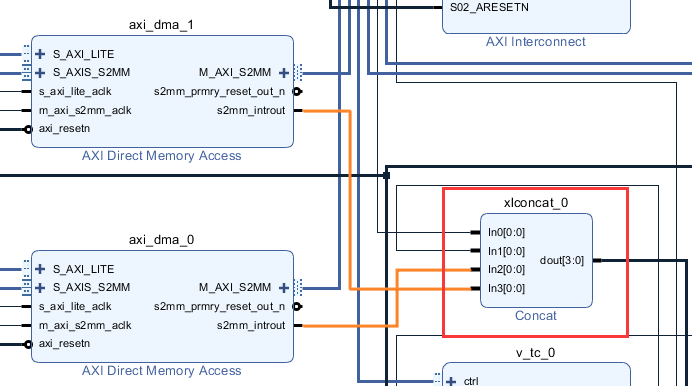

4. 添加AXI SLAVE接口到AXI Interconnect模块

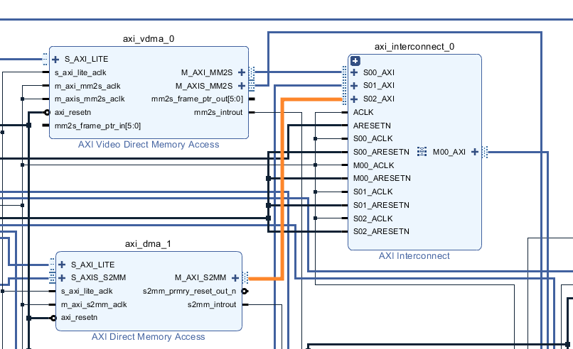

5. 修改CPU的时钟配置,将FCLK_CLK2修改为65MHz,供ADC时钟使用

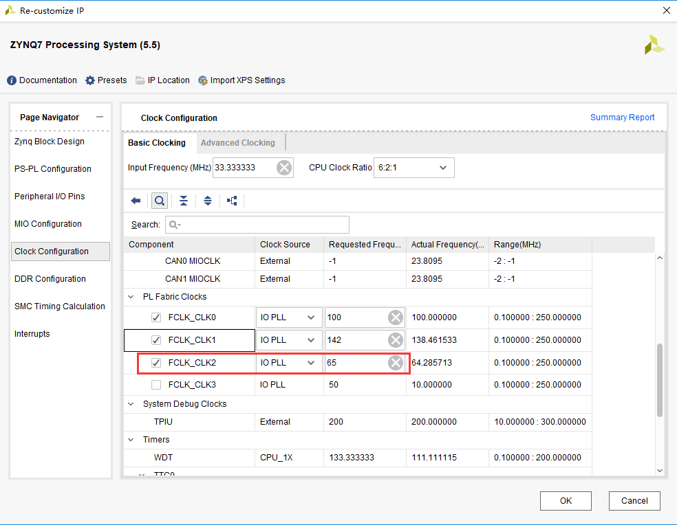

6. 将时钟引出两路,提供给两个AD9238芯片

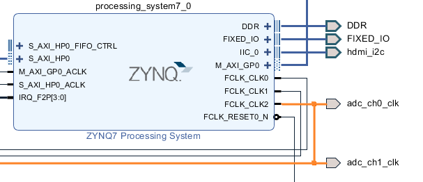

由于FCLK_CLK2只能引出一个引脚,需要在空白处右键选择create port,填写引脚名称,方向,类型,并将引脚连接到FCLK_CLK2

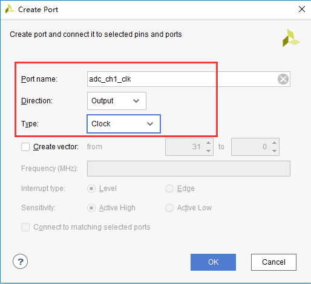

7. 将AD9238的数据引脚引出,并修改名称

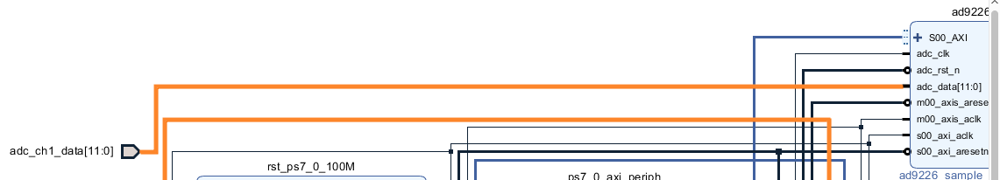

8. 连接好其余信号,保存,点开Address Editor,查看地址配置,如果有些模块没有配置地址,点击Auto Assign Address

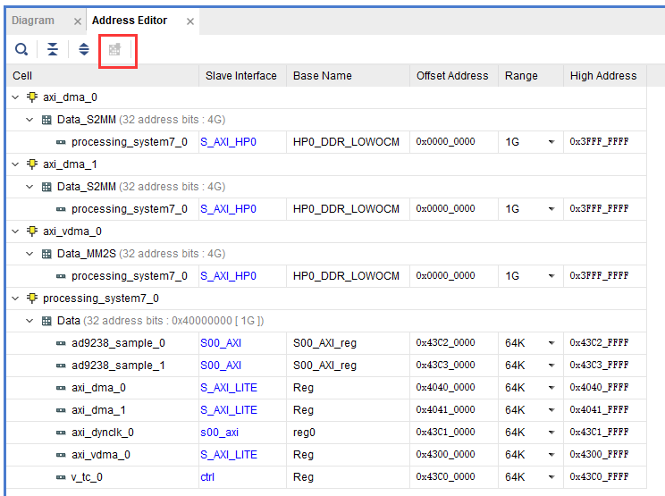

9. Generate Output Products和Create HDL Wrapper,在XDC中绑定AD9238引脚,之后生成bit文件

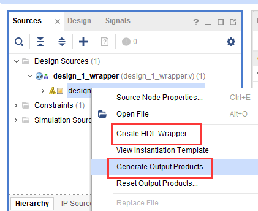

18.3Vitis程序开发
========================================
1. 与AN108实验的VITIS开发类似,但需要叠加两个ADC波形,定义了两个DMA接收缓存

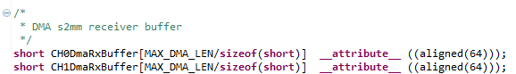

2. 设置ADC_COE为16, 2^4,也就是将AD9238的12bit转换成8bit,ADC_BYTE为2,ADC_BITS为有效数据宽度,设置为12,FPGA程序中将12bit数据扩展为16bit。

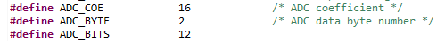

在调用波形叠加函数draw_wave时,Sign符号设置为UNSIGNEDSHORT

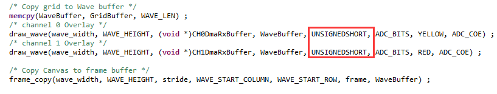

其他操作与AN108类似

18.4板上验证
========================================
1.连接电路板如下图所示,将AN9238模块插到扩展口,连接SMA接口到波形发生器,连接HDMI线到显示器,打开电源。为了方便观察显示效果,波形发生器采样频率设置范围为100KHz~1MHz,电压幅度最大为10V

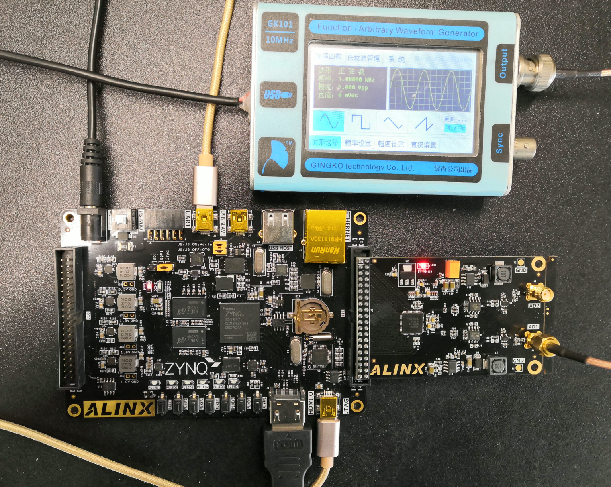

AX7020/AX7010硬件连接图(J11扩展口)

2.下载程序

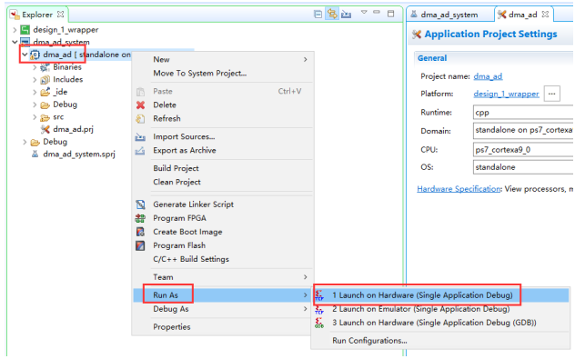

3.显示结果如下

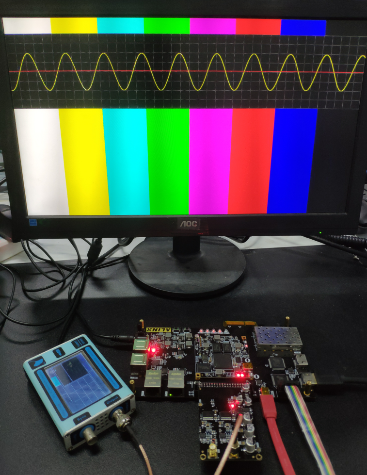

.. image:: images/images_0/888.png  

*ZYNQ-7000开发平台 FPGA教程*    - `Alinx官方网站 <http://www.alinx.com>`_
