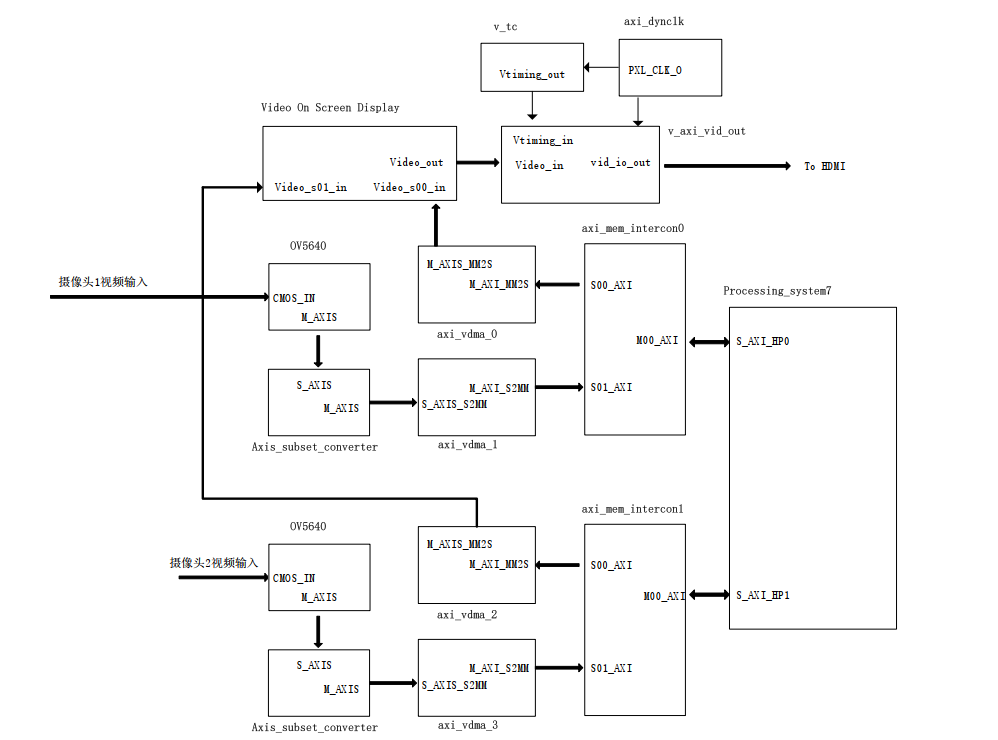

.. image:: images/images_0/88.png  

========================================
《第二十三章》OV5640摄像头的采集显示二
========================================
**实验Vivado工程为“ov5640_dual”。**

前面的教程我们讲解了双目摄像头模块AN5642的使用,但是我们只用了其中一路,无法发挥双目摄像头的优势。近几年双目应用飞速发展,在3D视觉、VR、视频智能分析,工业自动化等领域都有广泛使用,但双目应用往往对系统计算性能、接口扩展性灵活性有很高的要求,目前还没有asic或soc能解决双目应用的一系列问题,zynq集成了FPGA和arm,为双目应用的前期方案验证带来了极大的方便。

23.1双目和单目摄像头开发的区别
========================================
单目摄像头工程我们使用2个VDMA解决视频数据的输入输出问题,双目就需要4个VDMA,这个时候输出到HDMI的时候就有很大的不同,我们采取视频层叠加的方式,这样可以把2路VDMA输出的AXI-Stream合并为一路叠加的AXI-Stream,再送到显示模块显示,因为增加了一路,这里要控制好ddr的数据带宽,这里使用HP0和HP1端口,2 * 64bit * 150Mhz,完全满足2路视频输入输出的带宽要求。

23.2硬件环境搭建
========================================
先看一下zynq系统的整体框图,这里面和单目相比多出了2个VDMA,还有一个重要的OSD模块。

设计好后的vivado工程如下图所示:

由于整个系统是基于前面教程一步一步建立起来的,这里不再讲述已经讲过的,仅仅说一下Video On Screen Display这个IP的设置,首先这里没有启用AXI4-Lite的控制,配置参数都是静态的。 Video Format选择RGB,Video Compoment Width选择8,Maximum Screen Width 填写1920,因为我们输出分辨率设置为1920x1080。

在Screen Layout Options选项卡中的Background Size(背景层) 设置为1920x1080和输出分辨率要完全一致,否则不能正常使用。视频层参数的设置,包括上下偏移量,层的大小,以及透明度的设置。Background Color 设置为纯蓝,可能大家在这里有些疑问,明明设置的是绿色,为什么说是蓝色呢,这里牵涉到OSD的数据格式,是按照RBG显示的,而我们给OSD的数据是按RGB格式的,因此实质上设置的背景颜色的G被映射到了图像数据RGB的B上,所以显示为蓝色。

还有一点要修改的是,将两个IIC都设置成EMIO输出,配置两个cmos sensor。

以及cmos的复位宽度改为2

23.3软件Vitis的编写
========================================
先生成bit文件,然后导出硬件,运行Vitis,如下图,笔者这里只有top_hw_platform_0,如果工程位置变动会出现top_hw_platform_1、top_hw_platform_2等,笔者一般保留一个最新的(其它删除) ,然后重命名为top_hw_platform_0,这样可以方便其他人使用,不知道有没有更简便的方法。

和前面单目应用程序的区别也很大,我们修改了一个关键的地方,在display_ctrl.h的DisplayCtrl中的结构体,我们把部分成员设置为数组了,这样可以适应多个VDMA的情况,修改完这个结构体以后很多相关的代码也要修改。

::

 typedefstruct {
 		u32dynClkAddr; /*Physical Base address of the dynclk core*/
 		XAxiVdma *vdma[DISPLAY_NUM_VDMA]; /*VDMA driver struct*/
 		XAxiVdma_DmaSetupvdmaConfig[DISPLAY_NUM_VDMA]; /*VDMA channel configuration*/
 		XVtcvtc; /*VTC driver struct*/
 		VideoModevMode; /*Current Video mode*/
 		u8 *framePtr[DISPLAY_NUM_VDMA][DISPLAY_NUM_FRAMES]; /* Array of pointers to the framebuffers */
 		u32stride[DISPLAY_NUM_VDMA]; /* The line stride of the framebuffers, in bytes */
 		doublepxlFreq; /* Frequency of clock currently being generated */
 		u32curFrame[DISPLAY_NUM_VDMA]; /* Current frame being displayed */
 		u16HoriSizeInput[DISPLAY_NUM_VDMA];
 		u16VertSizeInput[DISPLAY_NUM_VDMA];
 		DisplayStatestate; /* Indicates if the Display is currently running */
 } DisplayCtrl;

还有输出分辨率的修改,在单目应用中,我们输出分辨率是1280x720,这里改为1920x1080。修改关键点如下图:

23.4板上验证
========================================
在Vitis中同样配置run 的选项如下面的图中所示:

程序运行以后,HDMI显示器显示两个摄像头的视频图像。

AX7015硬件连接及显示效果图

.. image:: images/images_23/image724.png  
   :align: center

AX7021硬件连接图(J16扩展口) 

AX7020/AX7010硬件连接图(J10扩展口)

AX7Z035/AX7Z100硬件连接图
	

.. image:: images/images_0/888.png  

*ZYNQ-7000开发平台 FPGA教程*    - `Alinx官方网站 <http://www.alinx.com>`_
