==================================================
《第三十二章》基于AN706模块的ADC采集之以太网传输
==================================================
**实验Vivado工程为“ad7606_lwip”。**

本章以AN706模块为例,介绍将ADC采集的数据通过以太网传输到上位机。传输协议请参考AN108以太网传输实验的制定传输协议一节,不再赘述。

32.1硬件环境搭建
==================================================
基于AN706 SG DMA的工程,将显示部分的的模块都删除,最终连接结果如下：

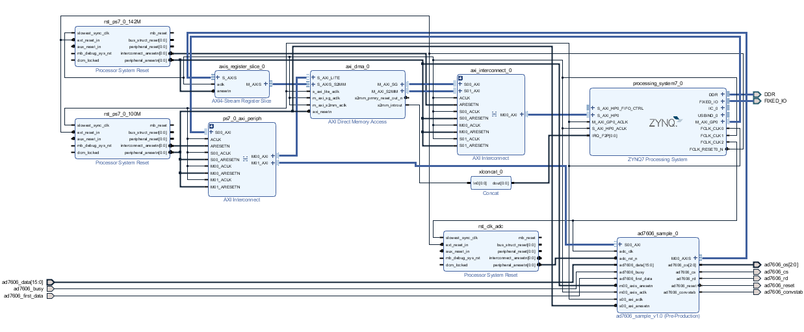

只保留AD7606引脚绑定

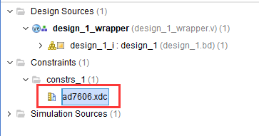

重新生成下载文件,导出硬件信息。

32.2Vitis程序开发
==================================================
32.2.1 ADC采集部分
---------------------------------
3. ADC的采集在前面已经讲过,在本章的Vitis中加入dma_bd和adc_dma.h

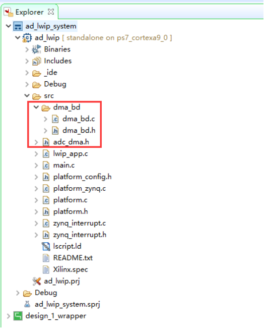

4. 在main.c文件的main函数中,中断初始化,进行DMA的初始化,中断连接,建立BD链表

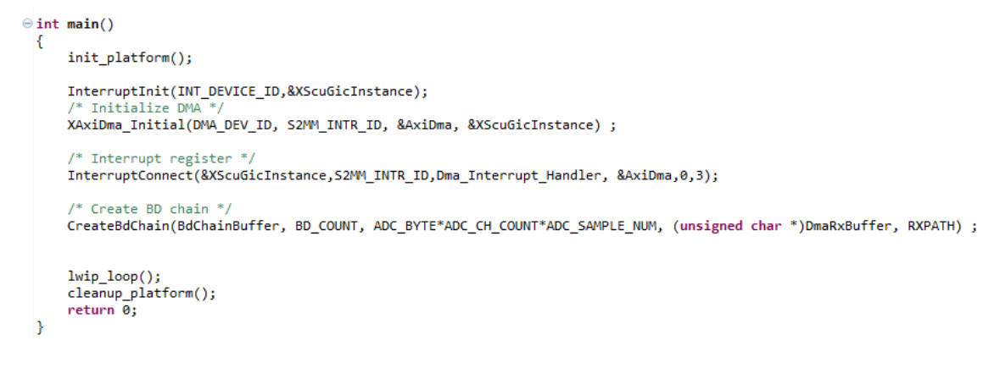

32.2.2 LWIP控制部分
---------------------------------
LWIP控制部分请参考AN108以太网传输,基本一致。

需要注意的是上位机设置的缓存大小为1MB,由于AD7606的采样速度比较低,为了上位机显示效果,将adc_dma.h中的采样数设置成1024*32

在lwip_app.c文件的while循环中,只取了CH1的数据。

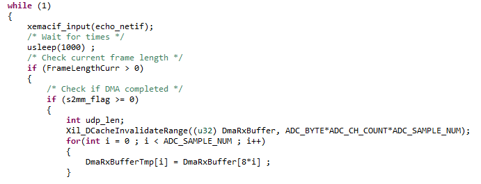

32.3板上验证
==================================================
6. 连接开发板如下所示,需要保证PC网卡为千兆网卡,否则会因为网络速度过低,导致无法显示。将AN706模块插到扩展口,连接SMA接口到波形发生器,为了方便观察显示效果,波形发生器采样频率设置范围为50Hz~10KHz,电压幅度最大为10V

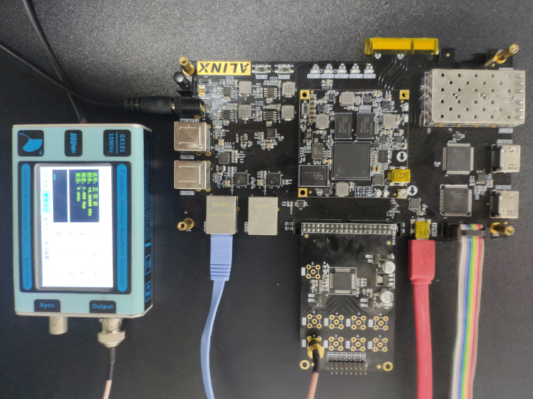

AX7015硬件连接图

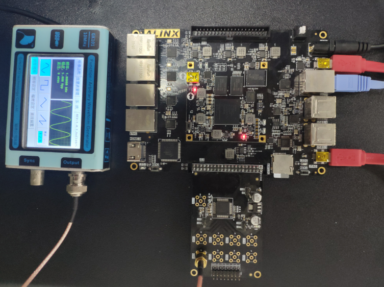

AX7021硬件连接图(J15扩展口)

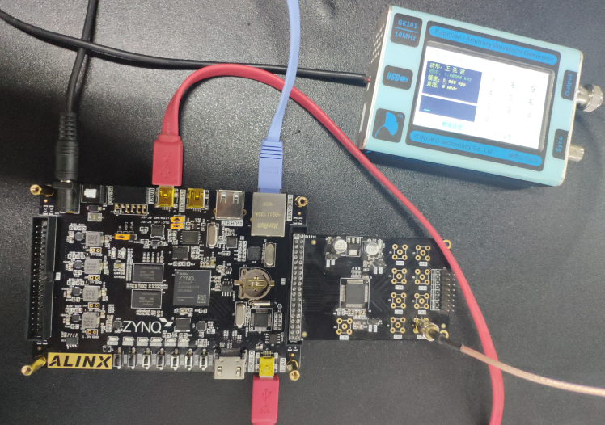

AX7020/AX7010硬件连接图(J11扩展口)

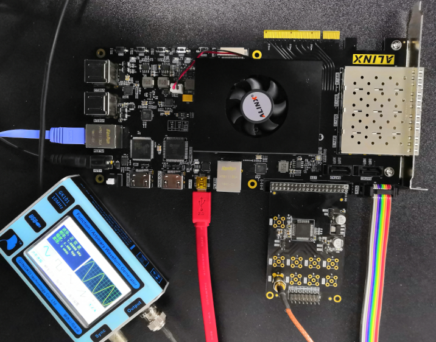

AX7Z035/AX7Z100硬件连接图

7. 如果有DHCP服务器,会自动分配IP给开发板;如果没有DHCP服务器,默认开发板IP地址为192.168.1.11,需要将PC的IP地址设为同一网段,如下图所示。同时要确保网络里没有192.168.1.11的IP地址,否则会造成IP冲突,导致无法显示。可以在板子未上电前在CMD里输入ping 192.168.1.11查看是否能ping通,如果ping通,说明网络中有此IP地址,就无法验证。
没有问题之后打开putty软件。

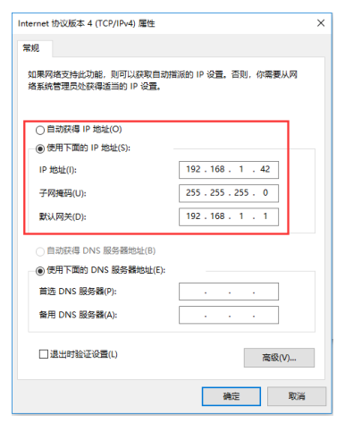

8. 下载程序到开发板,在putty中可以看到打印信息如下

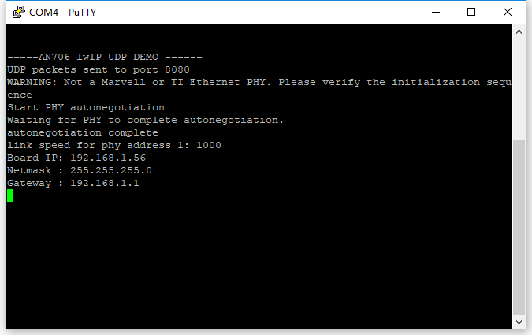

9. 在工程目录下,打开示波器.exe

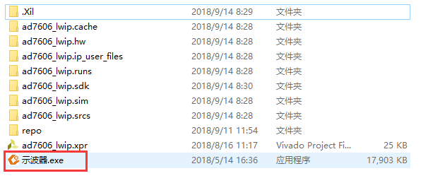

10. 显示结果如下

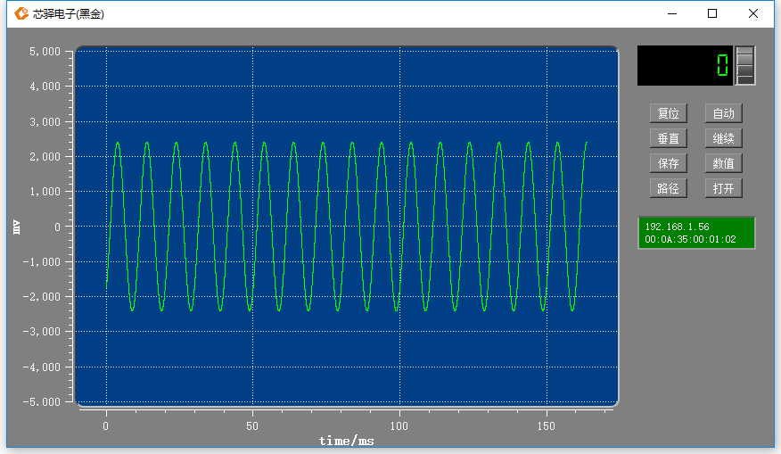

上位机软件使用方法,请参考AN108以太网传输的上位机软件使用说明一节。

       
.. image:: images/images_0/888.png  

*ZYNQ-7000开发平台 FPGA教程*    - `Alinx官方网站 <http://www.alinx.com>`_
