========================================
《第二章》PYNQ快速上手
========================================
2.1PYNQ镜像
========================================
AX7010/AX7020出厂程序不支持PYNQ,需要重新烧写镜像到SD卡,烧录方法如下(关于如何制作一个PYNQ镜像,可以参考官网相关教程,本教程不提供镜像制作方法)

1. 解压镜像压缩包ax7010-2.4.zip或ax7020-2.4.zip,得到一个扩展名为img的文件
2. sd卡(至少8G,烧写后原有内容全部丢失)用读卡器插在电脑USB口,准备烧写
3. 下载Win32DiskImager镜像烧写工具,这个工具用途广泛,比如树莓派烧写镜像,然后以管理员权限运行

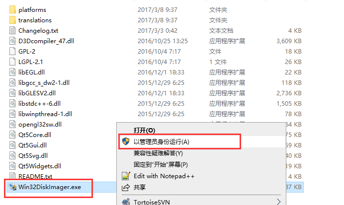

4. 选择镜像文件,再选择设备,注意要选sd卡所在盘符,然后点击写入

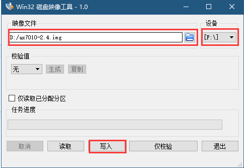

5. 写入完成以后的sd卡,被分为2个分区,第一分区为FAT32,可以在windows下看到,第二分区为EXT4,Windows下不可见。

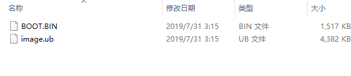

2.2运行PYNQ
========================================

1. sd卡插回开发板,确认开发板启动模式为sd卡模式
2. 连接开发板网口到路由器(最好支持DHCP),如果路由器支持DHCP,开发板上电后会自动获取IP地址,并可以用主机名pynq来访问,如果不支持DHCP,开发板会启动静态IP地址192.168.2.99
3. 连接开发板的UART口到电脑的USB口
4. 使用Putty为串口调试工具,使用方法参考基础教程

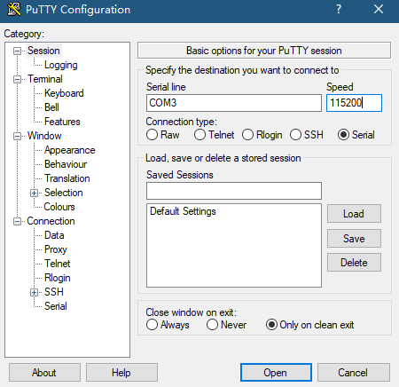

5. 上电运行,从打印信息可以看出跟文件系统是Ubuntu 18.04

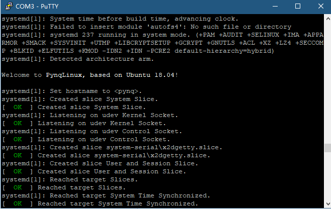

6. 如果路由器支持DHCP,在浏览器里输入http://pynq:9090,如果路由器不支持DHCP,先修改电脑IP到192.168.2.x网段,然后浏览器输入http://192.168.2.99:9090

7. 输入登录密码:xilinx,点击”Log in”

8. 可以看到一个类似文件管理器的界面

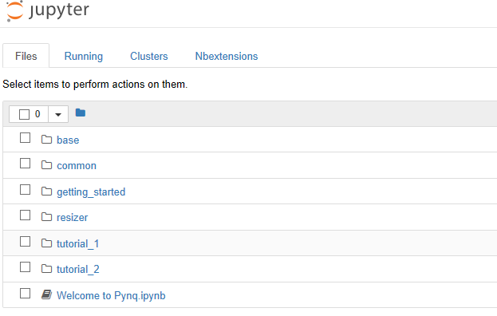

9. 先找到一个通俗易懂的例子运行一下,在common文件夹,点击“zynq_clocks.ipynb”

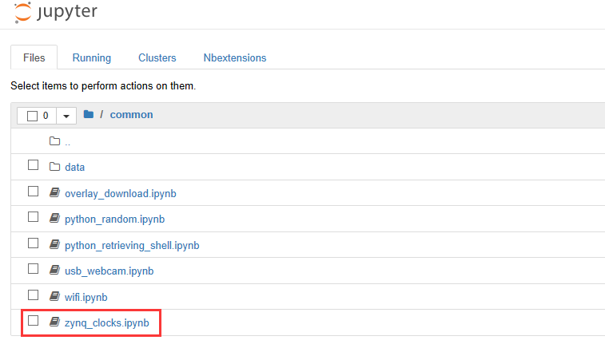

10. 打开后会有一个状态提示“Kernel starting,please wait…”,这个时候还不能点击“Run”

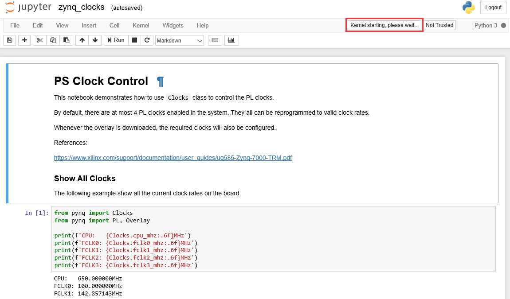

11. 等状态变为“Kernel idle”是可以点击“Run”

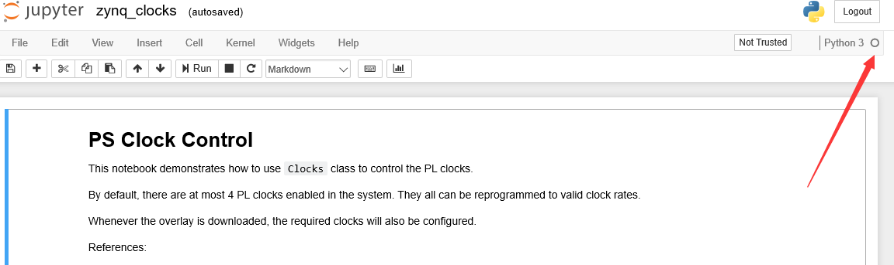

12. 用鼠标可以选择称为“cell”的运行单元,运行单元有4类,常用类为Markdown和Code,顾名思义,Code就是代码,Markdown是文本,相当于注释,虽然“cell“都可以运行,但只有标记为”Code“的才有意义

13. 一般我们从第一个cell开始运行,我们运行第一段代码后,在cell下面会给出打印结果,结果显示cpu主频为666.666666Mhz。特别要注意:每次点击Run后请等待状态变为“Kernel ilde“,再运行下一个cell。

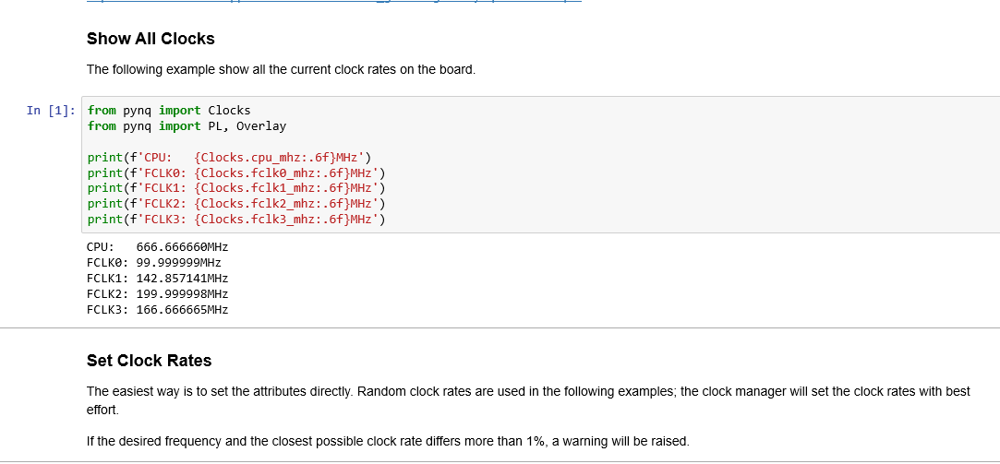

14. 运行结束后,可以点击保存,当前程序和状态都保存起来

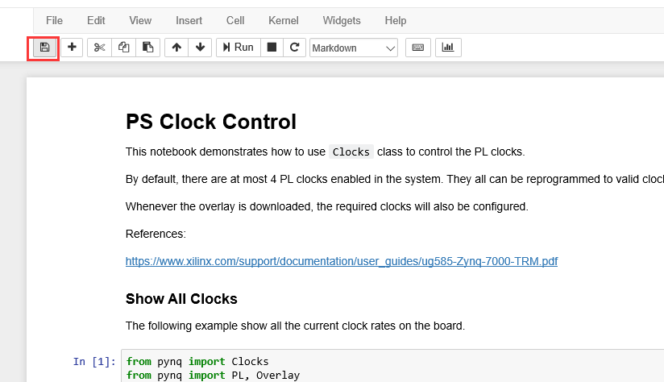

15. 最后可以点击File -> Close and Halt退出程序

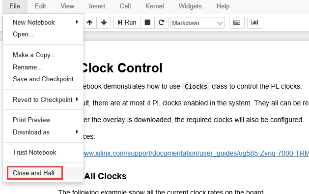

2.3samba文件共享
========================================
PYNQ提供了了samba共享文件夹,方便上传和下载文件,使用方法如下:

1. 路由器支持DHCP时在资源管理器里输入\\pynq,不支持的输入\\192.168.2.99

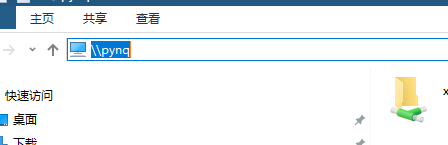

2. 双击“xilinx“文件夹

3. 用户名和密码都输入“xilinx”

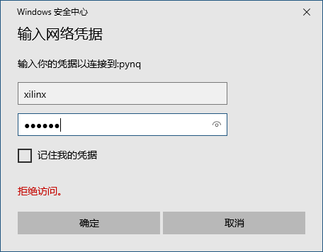

4. 可以看到开发板上的文件夹和文件

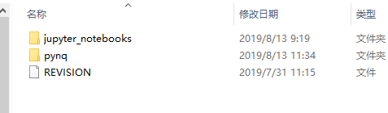

2.4常见问题
========================================
使用http://pynq:9090无法访问

有些系统无法通过hostname访问,这个使用我们要用ip地址直接访问,在串口终端中输入命令ifconfig,eth0的ip地址就是DHCP分配到ip地址,如果没有地址,表明DHCP分配失败。在浏览器输入http://192.168.1.212:9090代替http://pynq:9090

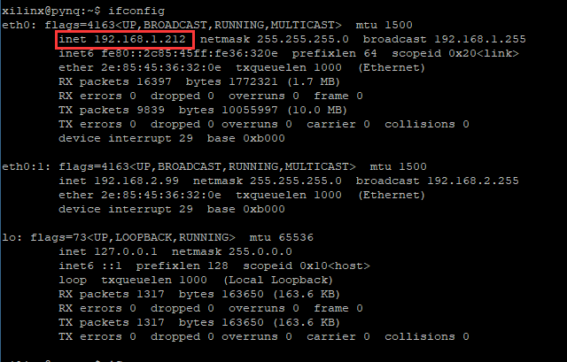

.. image:: images/images_0/888.png  

*PYNQ 开发平台 FPGA教程*    - `Alinx官方网站 <http://www.alinx.com>`_