.. image:: images/images_0/88.png  

========================================
《第四章》基于寄存器操作自定义Overlays
========================================

本章内容讲解如何把通用的vivado工程导入到PYNQ,这是大家学习PYNQ梦寐以求的事情。

4.1vivado工程
========================================
如下图所示,vivado工程里核心模块是一个自定义IP,使用HLS编写,主要功能是完成c = a + b,前面已经说过,xilinx只提供了python寄存器、dma、vdma底层封装,也就是说不是所有vivado工程都能直接导入到PYNQ,只能是一些寄存器读写,dma操作的工程。

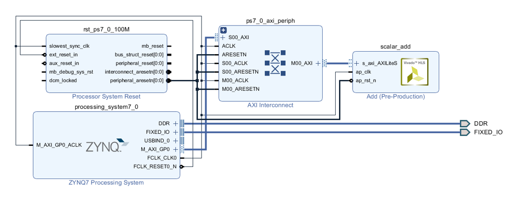

hls和vivado工程建立不是本教程关注的重点,如何使用hls和vivado可以参考其他教程,这里做个简单介绍。

在给的资料overlay_tutorial_17_4目录中有一下内容,ip为hls编写的ip源码,overlays为overlays的vivado工程和tcl文件。build_all.tcl脚本为hls编译、vivado工程编译脚本。

给的例程中已经编译完成,生成了tutorial_1、tutorial_2、tutorial_1.bit、tutorial_1.hwh、tutorial_2、tutorial_2.bit、tutorial_2.hwh,如果要再次编译,需要先删除这些文件。tutorial_1.bit、tutorial_1.hwh是本教程需要用到的2个文件、tutorial_2.bit、tutorial_2.hwh是后续教程需要用到的文件。

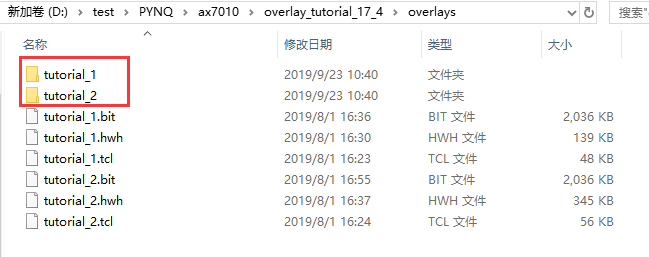

对于bit文件我们已经非常熟悉了,hwh文件前面也有概述,这里再说明一下,hwh文件是描述硬件连接信息的xml文档,通过hwh文件可以获取到硬件设计中的IP信息、寄存器信息、中断信息,PYNQ框架通过解析hwh文件自动匹配相关的IP驱动、自动获取IP的地址信息等。

4.2建立botebook
========================================
1. 使用浏览器登录PYNQ notebook

2. 使用“New -> Folder”创建一个新文件夹

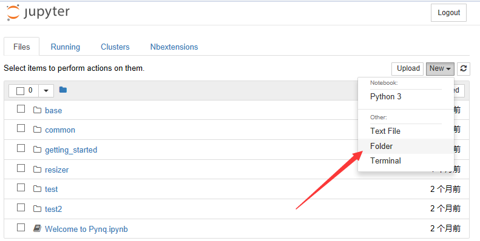

3. 重新命名为“overlay_tutorial”

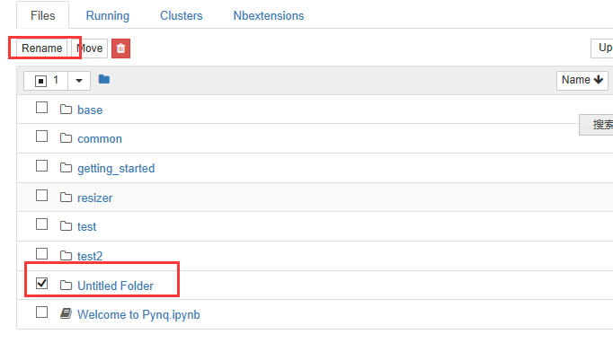

4. 进入目录“overlay_tutorial”,点击“Upload”上传文件

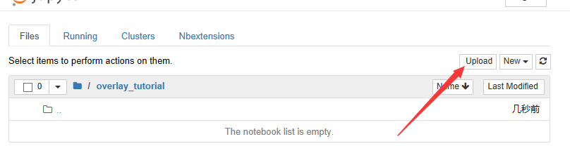

5. 把tutorial_1.bit、tutorial_1.hwh都选择上传,然后点击“Upload”

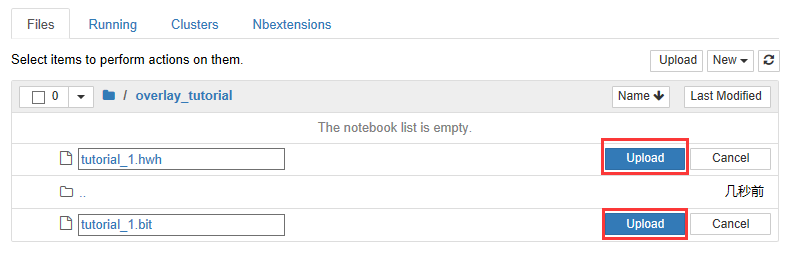

6. 上传完成

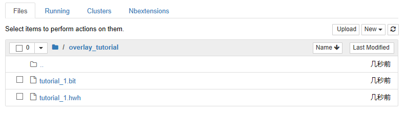

7. 新建一个Notebook

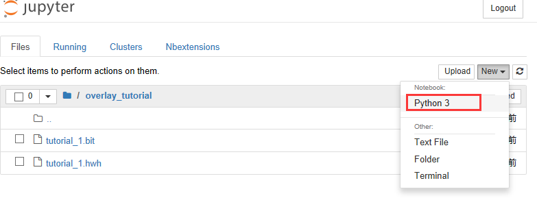

8. 弹出notebook编辑界面,默认是一个Code类型的cell,

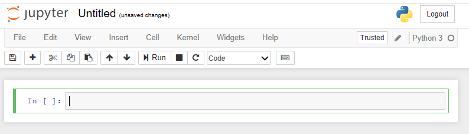

9. 开始编辑Notebook,编辑过程比较简单,类似于word的使用,编辑过程不是教程重点

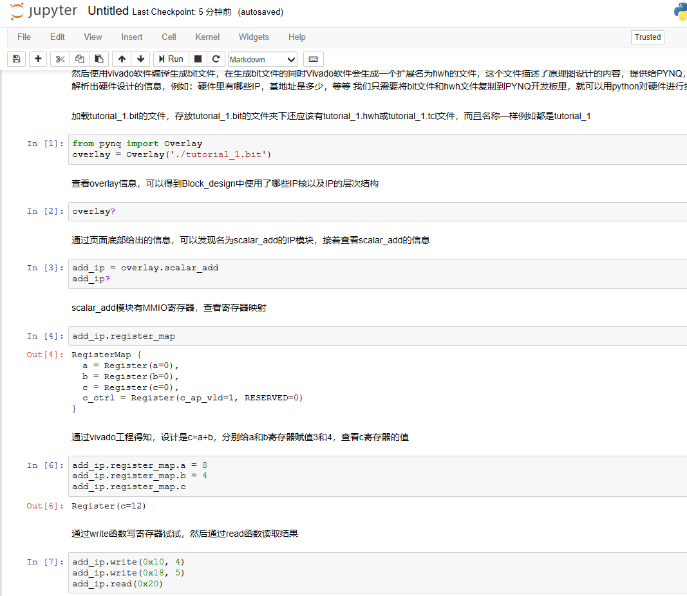

10. 由于notebook里有详细的注释、这部分python程序不再讲解

11. 最后不要忘了点击保存

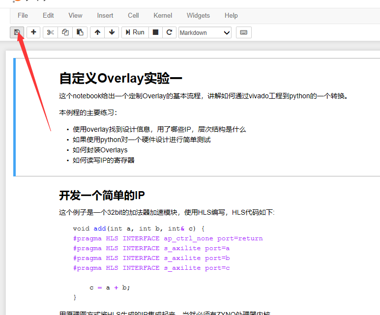

12. 为了方便记忆,将刚才botebook修改为” tutorial_1.ipynb”

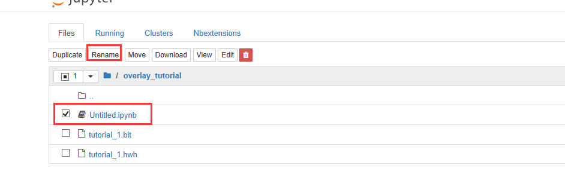

通过samba访问 \\192.168.x.xxx\xilinx\jupyter_notebooks\overlay_tutorial,可以找到我们上传和新建的文件,samba访问前面已经讲过,账号为xilinx、密码为xilinx。

.. image:: images/images_0/888.png  

*PYNQ 开发平台 FPGA教程*    - `Alinx官方网站 <http://www.alinx.com>`_