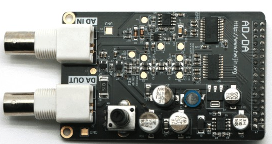
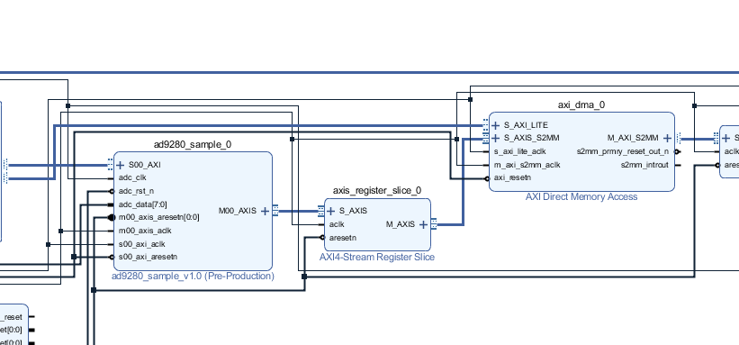
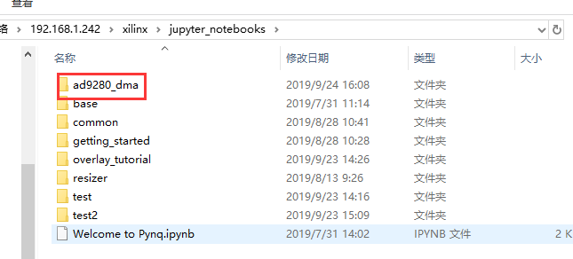
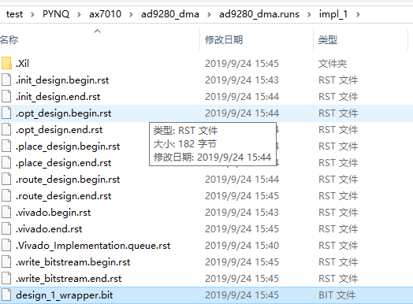
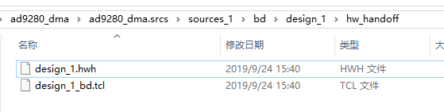
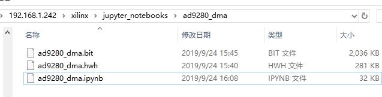
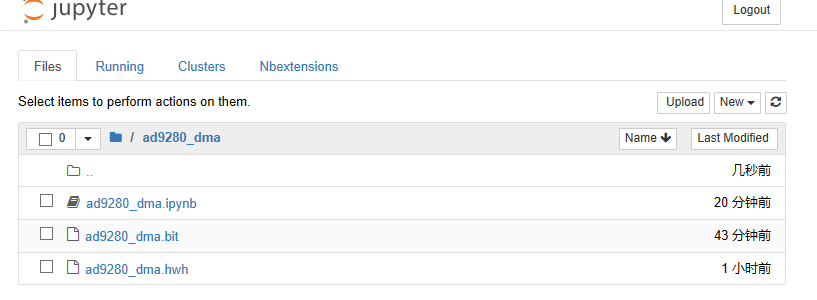
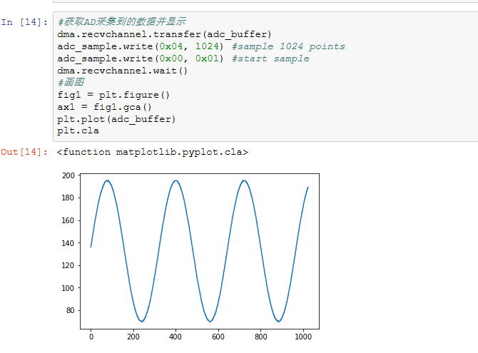

.. image:: images/images_0/88.png  

========================================
《第六章》ADC采集并显示波形
========================================

在前面的实验中我们学习了使用PYNQ操作dma,但是不太直观,本实验通过采集ADC数据并显示出波形,用更直观的实例来说明dma的使用。

6.1ADC硬件
========================================
实验中使用模块为AN108,一路32M采样率ADC、一路125M采样率DAC,实验中使用了其中的ADC通道。在SDK例程中我们已经使用过AN108模块,这里不做说明了。

6.2Vivado工程
========================================
Vivado工程来自course_s2的ad9280_dma_hdmi,这里删除了HDMI显示部分,删除了DMA的中断连接,这里不再讲解这个Vivado工程。

6.3Notebook文件
========================================
1.通过samba访问 \\192.168.x.xxx\xilinx\jupyter_notebooks,新建一个文件夹ad9280_dma用于存储bit文件、hwh文件和jupyter_notebook文件

2.将design_1_wrapper.bit文件复制到\\192.168.x.xxx\xilinx\jupyter_notebooks\ad9280_dma,并重命名为ad9280_dma.bit

3.将design_1.hwh复制到\\192.168.x.xxx\xilinx\jupyter_notebooks\ad9280_dma并重命名为ad9280_dma.hwh

4.如果不想自己再编辑notebook,把ad9280_dma.ipynb文件复制到\\192.168.x.xxx\xilinx\jupyter_notebooks\ad9280_dma

5.浏览器登录打开notebook

6.等Kernel start完成才能运行

7.100Khz正弦波,运行结果

.. image:: images/images_0/888.png  

*PYNQ 开发平台 FPGA教程*    - `Alinx官方网站 <http://www.alinx.com>`_
